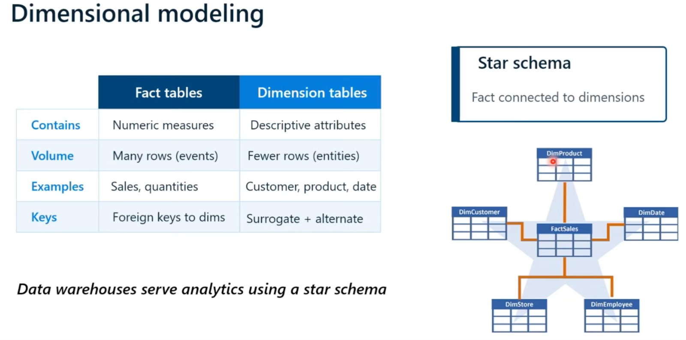
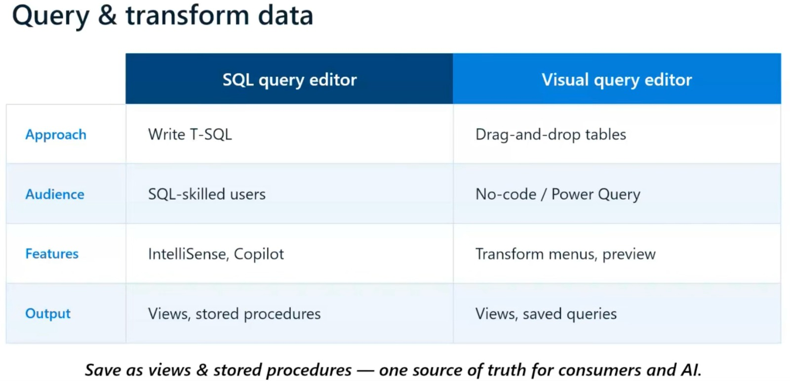
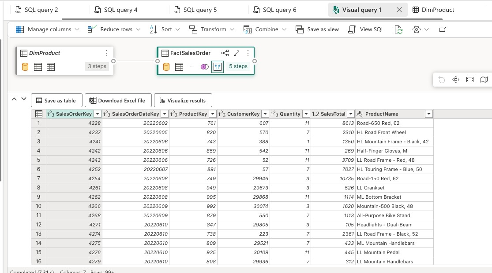

# 📘 Microsoft Fabric Boot Camp — Day 2 Notes

**Course:** DP-600 – Implement Analytics Solutions Using Microsoft Fabric
**Topics:** Data Warehousing & Real-Time Intelligence
**Hands-on lab:** [Analyze data in a data warehouse](https://microsoftlearning.github.io/mslearn-fabric/Instructions/Labs/06-data-warehouse.html)


## 1️⃣ Data Warehouse Fundamentals

### OLTP vs OLAP
| | OLTP (source systems) | OLAP (data warehouse) |
|---|---|---|
| Purpose | Many small, fast writes | Complex analytical reads |
| Examples | POS systems, ERP, CRM | Fabric Warehouse |
| Risk if misused | Analytics queries slow down live transactions | N/A — built for this |

**Key lesson:** Don't run heavy analytics directly against operational (OLTP) systems — it competes for compute with live transactions and can break the business (e.g., orders failing to process). This is *why* warehouses exist: consolidate data from many source systems into one analytics-friendly, centralized structure.

**Anti-pattern flagged in class:** Connecting Power BI directly to a source SQL database and doing all transformations/import there. Works at first, then reports get huge and slow. Fix: push transformations *upstream* into the warehouse, not downstream in the report.

### Dimensional Modeling Vocabulary
- **Fact table** — numeric measures / *events you observe* (sales amount, quantity, counts). Many rows. Contains foreign keys to dimensions.
- **Dimension table** — descriptive attributes / the *who, what, when, where* (customer, product, date). Fewer rows, one row per entity.
- **Star schema** — fact table in the center, connected to dimension tables via keys. Keeps the fact table as small/narrow as possible (critical at scale — 1M rows × 8 flat columns bloats fast vs. keeping descriptive attributes in dimensions).
- **Snowflake schema** — dimensions normalized further into sub-dimensions (e.g., splitting Customer into Customer + Region).
- **Surrogate key** — system-generated integer identifier (e.g., ProductKey).
- **Alternate/business key** — the original, human-meaningful identifier the business uses.


### Fabric Data Warehouse Capabilities
- Full **T-SQL**: CREATE, ALTER, DROP, INSERT, UPDATE, DELETE, MERGE all supported.
- **Fully managed SaaS** — no server provisioning, no manual scaling; storage auto-saved as **open Delta format on OneLake**.
- Built-in **Copilot** — code completion + "explain query" for documentation.
- **Cross-database queries** using 3-part naming: `database.schema.table`.
- Can join warehouse tables with **lakehouse tables** and other warehouses.
- **External tool connectivity** via TDS protocol (SSMS, Azure Data Studio) — existing SQL workflows transfer directly.
- **Zero-copy table clones** — instant point-in-time snapshot via one T-SQL statement, ideal for testing schema/transformation changes without touching production.

### Exam-critical distinction
> **Warehouse = read + write. SQL Analytics Endpoint (on a Lakehouse) = read-only.**

### Security Layers (broadest → finest)
1. **Workspace role** (Admin / Member / Contributor / Viewer) — access to everything in the workspace.
2. **Item permission** — access to a specific item (e.g., just one warehouse) without full workspace access.
3. **Object-level SQL permission** — access to specific tables/views.
4. **Column-level security** — e.g., only HR sees the salary column.
5. **Row-level security** — e.g., Dept A only sees Dept A's sales rows.
6. **Dynamic data masking** — obscures sensitive values in query results.

All rules apply consistently regardless of access path (web editor, SSMS, Power BI, Copilot).

**Monitoring tools:**
- **Query insights** — 30 days of query history (system views).
- **DMV (Dynamic Management View)** — real-time view of active queries.

### Two Ways to Query/Transform



**Views** — saved, reusable query definitions so every analyst queries from the same shared logic (avoids inconsistent, non-performant duplicate queries).
**Stored procedures** — go further: multi-step logic, accept parameters, error handling via TRY/CATCH.
> Note: Views/procedures with *write* capability only exist properly in the **Warehouse** — a Lakehouse SQL endpoint is read-only so this is more limited there.

### Semantic Model on the Warehouse
- Define **relationships** (fact ↔ dimension via shared keys, many-to-one, single cross-filter direction) — without this, every report author writes their own joins inconsistently.
- Define **measures** (DAX) once — e.g., total revenue, YoY growth, average order value — so every report uses the same formula.
- **Clean up metadata**: hide staging tables & surrogate keys, use friendly column names, add descriptions.
- **Direct Lake mode**: Power BI gets live-data freshness *and* import-level performance — no scheduled refresh needed.
- Good metadata (friendly names + descriptions) also **improves Copilot/data agent accuracy** for natural-language queries.

### Gotchas mentioned in class
- FK/PK constraints can be declared in T-SQL but are **not enforced** in the warehouse — actual relationship enforcement happens in the **semantic model**, not the database engine.
- If you drop and recreate a table with the *same name*, an existing semantic model **won't pick it up automatically** — Fabric treats it as a different object internally (different ID). You need to rebuild the semantic model.

---

## Hands-On Lab — Exercise: "Analyze data in a data warehouse"

[Lab link](https://microsoftlearning.github.io/mslearn-fabric/Instructions/Labs/06-data-warehouse.html)

**Steps completed:**
1. Created a new workspace (Fabric trial/capacity licensing).
2. Created a new **Warehouse** item.
3. Created `dbo.DimProduct` table via T-SQL, inserted 3 sample rows.
4. Ran the provided script (`create-dw.txt`) to build the full star schema:
   - `DimCustomer`, `DimDate`, `DimProduct`, `FactSalesOrder`
5. **Queried fact + dimension tables** — aggregated sales revenue by year/month, then extended to a second dimension (sales region) using JOINs + GROUP BY.
6. **Created a view** (`vSalesByRegion`) to save the aggregation query for reuse — queried it with a simple `SELECT * FROM vSalesByRegion`.
7. **Visual Query (no-code)**: dragged `FactSalesOrder` + `DimProduct` onto canvas → merged on `ProductKey` (left outer join) → expanded `ProductName` → visualized results as a chart / exported to Excel.
8. **(Optional) Built a semantic model / star schema**:
   - Created relationships: `FactSalesOrder.ProductKey → DimProduct.ProductKey`, `.CustomerKey → DimCustomer.CustomerKey`, `.SalesOrderDateKey → DimDate.DateKey` — all many-to-one, single cross-filter direction.
9. Cleaned up: removed workspace when done.

**Practical tips picked up during the walkthrough:**
- Always **highlight the specific statement** before clicking Run in the SQL editor, or it runs from the top and errors on "table already exists."
- Copilot **"Explain query"** auto-generates documentation for a query — handy shortcut.
- Notebooks can also connect to a warehouse and run SQL, with the advantage of running each statement as a separate, isolated cell (vs. needing to highlight/select in the SQL editor).

---

## 2️⃣ Real-Time Intelligence

### Core concepts
- **Event** = a record of something that happened (sensor reading, click, transaction, status change).
- **Stream** = a continuous, time-ordered sequence of events.
- **Real-time analytics** = processing within seconds/minutes of the event occurring (vs. "near real-time" = some processing latency).
- **Why it matters:** Traditional batch/overnight refresh means hundreds of events can happen before a problem is even visible. Real-time analytics closes that gap — anomaly detection, adjusting operations as conditions change, not "the morning after."

### The Real-Time Intelligence pipeline
```
Sources → Event Stream → Eventhouse (KQL DB) → KQL Queries → Dashboards / Activator
```

| Component | Role |
|---|---|
| **Event Stream** | Ingests & routes streaming data; supports **in-flight transformations/filtering** (e.g., only accept events from one region). Sources: Event Hubs, IoT Hub, Service Bus, Kafka, GCP Pub/Sub, Amazon Kinesis, MQTT. |
| **Eventhouse** | Storage layer purpose-built for very high-velocity ingestion (millions of events/sec) — the "streaming equivalent of a Lakehouse." Contains one or more **KQL databases**, each with tables. Sits on OneLake, so other Fabric workloads can read it too. |
| **KQL Query Sets** | Where you save/organize/share KQL queries. |
| **Real-Time Dashboard** | Tiles connect directly to KQL queries and **auto-refresh continuously** — no scheduled refresh needed. Supports time-series charts, bar charts, maps, cards, tables. |
| **Activator** | Watches streams for thresholds/patterns/missing expected events, and **acts** — sends email, posts to Teams, or triggers a Power Automate flow. |
| **Real-Time Hub** | The umbrella experience under OneLake tying all of the above together, plus sample datasets (bicycle rentals, stock market, yellow taxi). |

**Hierarchy to remember:** Eventhouse (container) → KQL database(s) → Tables.

### Eventhouse vs Warehouse vs Lakehouse
- **Eventhouse** — streaming, time-series, log data, high ingestion rate. Data is retained indefinitely (no auto-deletion).
- **Warehouse** — structured business data, complex joins, slowly changing dimensions.
- Different tools for different data shapes and speeds — not interchangeable.

### KQL (Kusto Query Language) Basics
KQL reads top-to-bottom as a **pipeline**, chained with the pipe `|` character — each line does one thing, and you can build queries incrementally.

| KQL operator | Roughly maps to SQL |
|---|---|
| `take` | `TOP` / `LIMIT` |
| `where` | `WHERE` |
| `summarize` | `GROUP BY` (+ aggregation) |
| `project` | `SELECT` |

Example:
```kql
StockTable
| where Timestamp > ago(5m)
| summarize AvgPrice = avg(BidPrice) by Symbol
```

> Underlying tech: KQL/Eventhouse is built on the same engine as **Azure Data Explorer (Kusto)** — the same technology behind Azure Monitor / Log Analytics Workspace logs.

### Real-time dashboards ≠ Power BI dashboards
- Power BI = historical analysis, trend reporting, interactive BI (scheduled refresh, e.g., a few times/day in Import mode).
- Real-time dashboards = **live operational views**, always current, no refresh button needed.

### Activator
- Monitors a condition (threshold breach, detected pattern, or an **expected event that never arrives** — often the most important case).
- On trigger: sends email / Teams message / runs a Power Automate flow.
- Example from class: alert if a thermometer reading exceeds 35°C.

---

## Hands-On Demo & Exercise — Real-Time Intelligence

**Demo (bicycle rental sample data):**
1. Created an Eventhouse → added sample "Bicycle rentals" data source → created Event Stream ("all bikes") → new table in Eventhouse.
2. Connected Event Stream → Eventhouse as the destination ("plumbing" analogy: stream = pipe, Eventhouse = the tank it fills).
3. Added an in-flight **filter transformation** on the stream (e.g., only keep records where neighborhood = "Mile End").
4. Wrote KQL queries (`take`, `where`) using Copilot for query generation.
5. Built a **Real-Time Dashboard** ("Bikes Real-Time Dashboard") with a table + map visual (bubble size = number of bikes).

**Exercise 4 — Stock market sample data (via Real-Time Hub):**
1. Real-Time Hub → Add data → Stock Market sample.
2. Created the **Event Stream first**, then created the **Eventhouse**, then connected them (reverse order from the demo — shows either order works).
3. Queried average stock price grouped by symbol over the last 5 minutes.
4. Saved query to a new dashboard ("Stock Dashboard") → renamed tile ("Average Prices") → changed visual from table to column chart → customized colors/sort order (with Copilot help for the underlying KQL).
5. Created an **Activator alert**: run query every 5 minutes, group by symbol, trigger (email/Teams) if average price increases by more than 100.


## Key Takeaways

- **Lakehouse = flexible/any format. Warehouse = structured/T-SQL native. Eventhouse = streaming/high-velocity.** Same OneLake foundation, three different jobs.
- Star schema exists to keep the **fact table lean** — don't flatten dimension attributes into the fact table at scale.
- **Warehouse = read/write, SQL Endpoint = read-only** — this distinction is explicitly called out as DP-600 exam-relevant.
- Relationships/constraints in T-SQL are **not enforced** by the engine — enforcement is a semantic-model concept.
- Real-time ≠ "Power BI but faster" — it's a genuinely different toolchain (Event Stream → Eventhouse → KQL → Dashboard/Activator) for a genuinely different problem (continuous, high-volume, time-sensitive data).
- KQL's pipe-based syntax (`take`, `where`, `summarize`, `project`) maps cleanly onto SQL concepts already known.

## 📝 Follow-up / To Revisit
- Medallion architecture — instructor mentioned it's technically DP-700 content but will cover it briefly on the last day if time allows.
- Practice more KQL query writing (map/dashboard building with Copilot took several iterations in the live demo — worth repeating solo).
- Row-level security and other advanced security patterns are planned for later sessions — revisit once covered.
