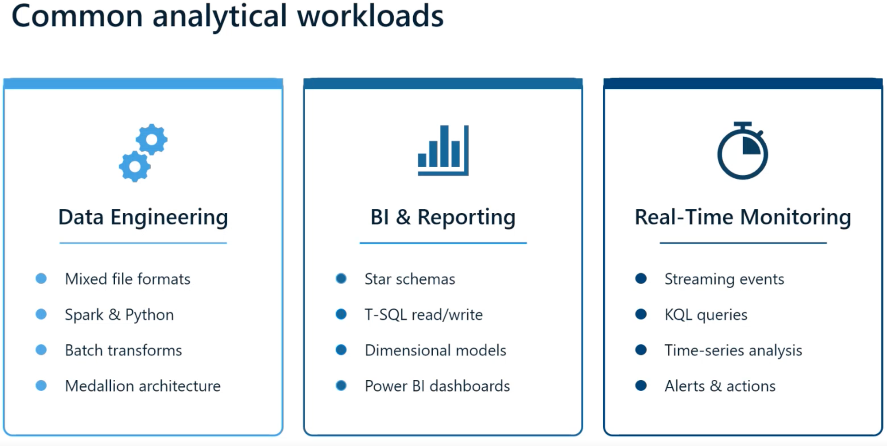
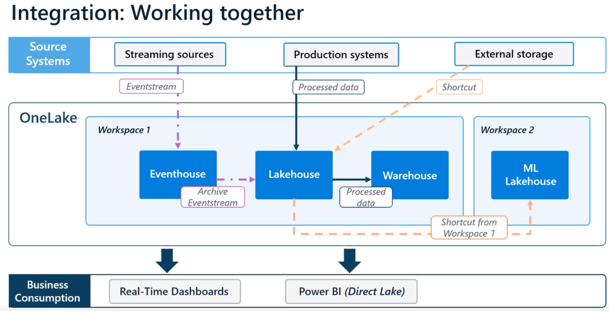
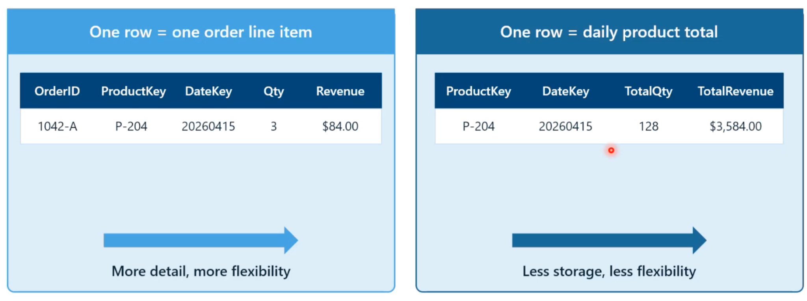
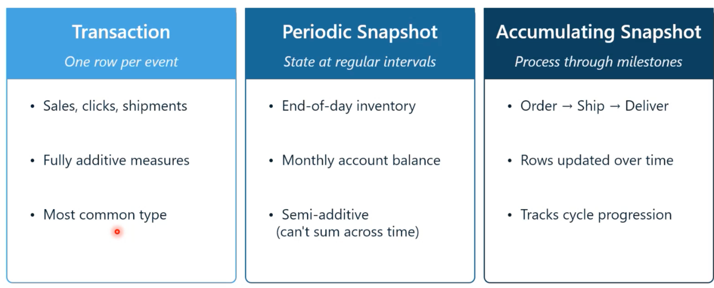
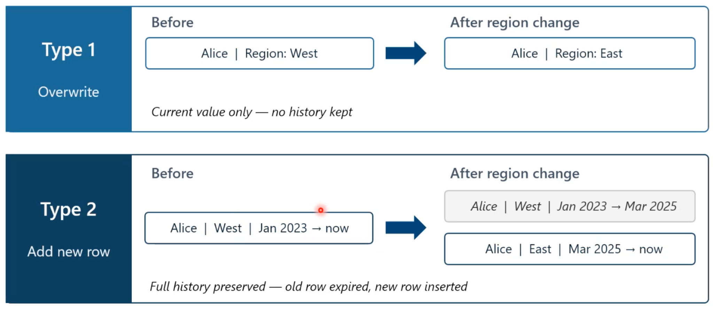
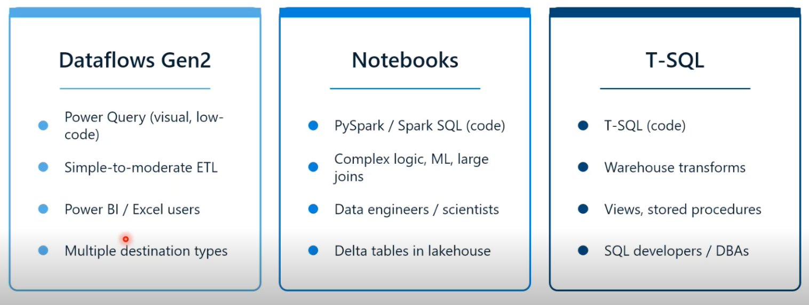
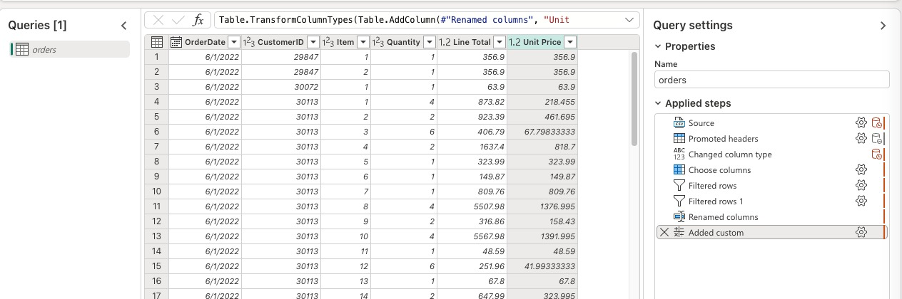

# Microsoft Fabric Boot Camp - Day 3 Notes

**Course:** DP-600 – Implement Analytics Solutions Using Microsoft Fabric
**Topics:** Choosing the Right Data Store · Dimensional Modeling for the Gold Layer · Data Flow Gen2 & Query Folding

---

## 1️⃣ Choosing the Right Data Store: Lakehouse vs Warehouse vs Eventhouse

> Framing for the day: these are not 3 competing products — they're **3 shapes of the same underlying idea**, all sitting on the same OneLake storage layer (open Delta/Parquet format). Choice is made **per workload**, not per organization.

### 3 common analytical workload


Most real organizations run **all three simultaneously** — e.g., sales/inventory curated in a warehouse for reporting, while clickstream/telemetry streams into an Eventhouse at the same time.

### Comparison across 5 decision factors
| Factor | Lakehouse | Warehouse | Eventhouse |
|---|---|---|---|
| **Best for** | Mixed formats, Spark engineering | Structured BI, star schemas | Streaming/time-series events |
| **Query language** | Spark (Python/Scala/SparkSQL) + read-only SQL endpoint | Full T-SQL (read + write) | KQL (pipe syntax) |
| **Write pattern** | Spark notebooks/dataflows → Delta tables | Full DML: insert/update/delete/merge | Append-only |
| **Schema handling** | **Schema-on-read** — flexible until first write, then frozen per table | **Schema-on-write** — defined upfront & enforced; nonconforming data rejected at load | Auto-indexed/partitioned by ingestion time |
| **Biggest advantage** | Most versatile — handles structured/semi/unstructured data; safe default when unsure | Multi-table **ACID transactions** — atomic commits across fact+dimension writes | Sub-second query performance on data seconds old, while ingestion continues |

### Practical decision rule
> The moment your design needs an **UPDATE or MERGE statement in SQL** (e.g., for Slowly Changing Dimensions), you need a **Warehouse** — the Lakehouse's SQL endpoint won't allow it (though the same logic *can* be done via a Delta merge in a Spark notebook against a Lakehouse).
> Ask: *"Who writes this load process, and in what language?"* — SQL developer/T-SQL → Warehouse. Python person → Lakehouse.

### They interoperate — this is the actual point of Fabric

- **Shortcuts**: a Lakehouse can reference Warehouse tables (or vice versa) without copying data.
- **Cross-database queries**: a Warehouse can query Lakehouse tables directly.
- **Eventhouse → OneLake**: enable "OneLake availability" on an Eventhouse database, and it becomes accessible from a Lakehouse/notebook via the OneLake catalog.
- **Event Stream can sink to either a Lakehouse or an Eventhouse** — streaming data isn't locked to one destination.


##  Dimensional Modeling for the Gold Layer

### Medallion architecture recap (bronze → silver → gold)
- **Bronze** — raw, untouched, append-only, organized by source/load date. Never modify it — it's your safety net to reprocess from scratch if downstream logic has a bug.
- **Silver** — cleaning & conformance: fix data types, handle nulls, deduplicate, standardize casing/codes (e.g., "CA" vs "California"), join related entities. Still close to source-level detail — data scientists often prefer this layer.
- **Gold** — restructured into **star schema** (fact + dimension tables) for consumption. Three reasons this layer exists:
  1. **Performance** — Power BI's columnar engine is optimized for star schemas (few large fact tables, many small dimensions).
  2. **Usability** — business-friendly names/groupings instead of 50 source-system tables.
  3. **Consistency** — calculations (measures) defined once, everyone reports the same number.
  > Gold is what feeds **Power BI, Copilot, and Fabric IQ**.

###  Grain — the most important design decision


**Grain = what does one row in the fact table represent?** Decide this *before* choosing columns, measures, or names.

- **Line-item grain** (e.g., 1 row = 1 order line) → more detail, more flexible, can still answer questions the aggregated version can't (avg items per order, % of orders with a discount, etc.), but more storage/rows.
- **Aggregated grain** (e.g., 1 row = daily product total) → fewer rows, faster scans, cheaper — but you permanently lose the ability to answer row-level questions.
- **Guidance:** default to the lowest level of detail unless there's a clear justification not to (e.g., billions of sensor readings where the business only ever needs hourly averages).
- Once chosen, **never mix grains** in the same fact table — and grain determines which dimensions can even connect (a line-item grain connects to Product; an order-header grain can't, since one order may span many products).

### Three fact table types


> If unsure, start with a low-grain **transaction fact table** — it answers the widest range of questions.

### Normalize facts, denormalize dimensions
- **Fact tables**: keep normalized — all keys point outward to dimensions.
- **Dimension tables**: flatten hierarchies into **one wide table** (e.g., Product with Category + Subcategory combined), instead of preserving a normalized source structure. This is the classic **star vs. snowflake** distinction — the sweet spot for analytics is **star**, not snowflake, because snowflake structures require multiple joins that hurt BI performance.
- Rule of thumb: normalization protects transactional systems from update anomalies; denormalization is what makes analytical queries fast and simple for BI users.

### Conformed dimensions
A single shared dimension (e.g., one `Product` table, one `Date` table) used consistently across **multiple fact tables** (e.g., Sales and Inventory) with the same keys/attributes — enables consistent cross-fact filtering (pick one date, instantly see sales *and* inventory for that date).

### Role-playing dimensions (multiple date roles)
If a fact table has multiple date columns (Order Date, Ship Date, Delivery Date), **do not create three separate date dimension tables**. Instead:
- Create **one active relationship** (e.g., to Order Date).
- Create **inactive relationships** for the others (Ship Date, Delivery Date).
- Use Power BI's `USERELATIONSHIP()` function in DAX to analyze using the inactive relationships when needed.

### Slowly Changing Dimensions (SCD)


**Why it matters (example from class):** if a salesperson changes regions and you used Type 1, a *previously run* sales report for that salesperson's old region will show different numbers when re-run later — because their sales moved with them. Type 2 avoids this: sales are permanently tied to whichever region version was active at the time of the sale.


**Exercise 1:** [Design and implement a dimensional model](https://microsoftlearning.github.io/mslearn-fabric/Instructions/Labs/26-design-dimensional-models.html)
📄 Full compiled T-SQL for this exercise: `Exercise1_ContosoDW_DimensionalModel.sql`

1. Created new workspace + Warehouse ("Contoso Data Warehouse").
2. Created fact and dimension tables via T-SQL — **schema defined upfront** (schema-on-write); re-running `CREATE TABLE` fails since it's already been created.
3. Dimension tables (`Product`, `Store`) included **`ValidFrom`, `ValidTo`, `IsCurrent`** columns — the Type 2 tracking columns.
4. Added table constraints (primary keys) — confirmed **not enforced** by the engine (Fabric doesn't validate FK/PK relationships at insert time; that enforcement only happens in the semantic model).
5. Loaded sample data; verified row counts per table.
6. Built a **semantic model** on top of the warehouse tables, connecting Fact ↔ Dimensions via drag-and-drop or Manage Relationships (many-to-one, single cross-filter direction) — this is where relationships actually become "real" for reporting purposes.
7. **Simulated a Type 2 change**: updated "Mountain Bike Pro" unit cost — old row expired (`ValidTo` set), new row inserted with new key and cost. Queried the fact table: January–April sales still correctly show the *old* cost; sales from the new effective date onward correctly show the *new* cost. Each fact row keeps the cost that was in effect **at the time of that sale**.
8. **Simulated a Type 1 change**: renamed a product ("Insulated Water Bottle" → new name) via straight overwrite — old name is now unrecoverable, by design.
9. Used Copilot to generate a query ("total sales by store region and product") as an example of AI-assisted query writing.


---

## Data Transformation in Fabric: Data Flow Gen2

### Three ways to transform data in Fabric

> These aren't mutually exclusive — a common real pattern: **Data Flow** does light cleaning into silver → **Notebook** does heavy transformation/modeling at scale → **T-SQL views/procedures** expose the final gold layer.

### What is Data Flow Gen2?
Cloud-hosted, low-code ETL — **Extract → Transform → Load**:
- **Extract**: 150+ built-in connectors (SQL Server, Azure SQL, Postgres, OneLake, SharePoint, CSV, JSON, XML, OData, etc.). Connections/credentials are managed centrally and reusable across data flows.
- **Transform**: Power Query Online — same interface as Power BI Desktop's Power Query, but running in the cloud, with a visible step-by-step **Applied Steps** list (reorderable, deletable, undoable).
- **Load**: choose a **destination** + **update method** — this is the key difference from Gen1 (which only output internally, consumable through Power BI). Gen2 can write to a Lakehouse, Warehouse, Azure SQL Database, or ADLS Gen2 — even multiple destinations from a single data flow.

### The typical Data Flow Gen2 workflow
1. **Connect** to source, choose specific tables/query.
2. **Filter & select early** — reduce rows and columns as soon as possible; every downstream step operates only on what's kept here (a double-edged sword: reduces processing cost, but if a future requirement needs a dropped column, you'll need a full reload).
3. **Clean & shape** — dedupe, handle nulls, fix data types (text→date, text→number), trim whitespace, standardize casing (e.g., "east" / "EAST" / "East" → one consistent value).
4. **Combine** — **Merge** (join, brings in columns from another query) vs **Append** (adds new rows, e.g., new sales on top of historical sales — never overwrite history for this pattern).
5. **Load** — pick destination + update method:

| Update method | Behavior |
|---|---|
| **Replace** | Drops & recreates the table each run — full snapshot |
| **Append** | Adds new rows only (e.g., ongoing sales/log data) |
| **Incremental** | Refreshes only changed data using a defined time window — needs a reliable "last modified/created" column *and* efficient filtering on it (i.e., query folding support) |

### Query Folding — critical performance concept
**Query folding** = Power Query translates your applied steps into the native query language of the *source* (e.g., SQL), pushing the processing down to the source system instead of pulling all raw data into the Power Query engine first.

- **Folding works**: filter/sort/merge/select-columns/group-by/rename/type-change steps sent to a real database engine (e.g., SQL Server) — the source does the heavy lifting and only the small result set comes back.
- **Folding breaks**: custom M columns, pivots/unpivots, cross-source merges, table buffering, complex text functions — once one step breaks folding, **every step after it** also runs in the Power Query engine, not the source.
- **Why it matters at scale**: with a 50M-row source, if folding breaks at step 2, all 50M rows have to be pulled into Power Query before any further processing — versus filtering down to 1M rows *at the source* first.
- **Practical fix**: reorder steps so all foldable operations (filters especially) happen **before** any operation that breaks folding — push as much work as possible to the top of the step list / down to the source.
- ⚠️ CSV/flat files have **no query engine to fold into** — everything runs in the Power Query engine regardless of step order, since there's no source-side database to push work to.


**Exercise 2 — CSV file → Lakehouse:**

 **Exercise 2:** [Transform data using dataflows in Microsoft Fabric](https://microsoftlearning.github.io/mslearn-fabric/Instructions/Labs/26b-transform-data-dataflows.html)
📄 Full applied power query/M Language steps for this exercise: 


```powerquery
let
  Source = Csv.Document(Web.Contents("https://raw.githubusercontent.com/MicrosoftLearning/dp-data/main/orders.csv"), [Delimiter = ",", Columns = 7, QuoteStyle = QuoteStyle.None]),
  #"Promoted headers" = Table.PromoteHeaders(Source, [PromoteAllScalars = true]),
  #"Changed column type" = Table.TransformColumnTypes(#"Promoted headers", {{"SalesOrderID", Int64.Type}, {"OrderDate", type date}, {"CustomerID", Int64.Type}, {"LineItem", Int64.Type}, {"ProductID", Int64.Type}, {"OrderQty", Int64.Type}, {"LineItemTotal", type number}}),
  #"Choose columns" = Table.SelectColumns(#"Changed column type", {"OrderDate", "CustomerID", "LineItem", "OrderQty", "LineItemTotal"}),
  #"Filtered rows" = Table.SelectRows(#"Choose columns", each [OrderDate] <> null and [OrderDate] <> ""),
  #"Filtered rows 1" = Table.SelectRows(#"Filtered rows", each [OrderQty] >= 0),
  #"Renamed columns" = Table.RenameColumns(#"Filtered rows 1", {{"OrderQty", "Quantity"}, {"LineItemTotal", "Line Total"}, {"LineItem", "Item"}}),
  #"Added custom" = Table.TransformColumnTypes(Table.AddColumn(#"Renamed columns", "Unit Price", each [Line Total] / [Quantity]), {{"Unit Price", type number}})
in
  #"Added custom"
```

1. New workspace + Lakehouse + Data Flow Gen2, connected to a CSV via "Import from Text/CSV."
2. Selected only needed columns: Order Date, Customer ID, Line Item, Order Quantity, Line Item Total.
3. Filtered rows: removed empty Order Dates; filtered Order Quantity > 0.
4. Verified/fixed data types: Order Date → Date, Order Quantity → Whole Number, Line Item Total → Decimal Number.
5. Renamed columns: `Order Quantity` → `Quantity`, `Line Item Total` → `Line Total`, `Line Item` → `Item`.
6. Added a **custom column**: `Unit Price` = `Line Total / Quantity` (decimal type).
7. Connected the destination (Lakehouse table) — a step easy to miss if the Lakehouse/Data Flow were created separately rather than together.
8. Used **Copilot in Power Query** to auto-add a step ("remove rows where order date is empty") — confirmed Copilot can directly modify the applied-steps list, not just suggest code.
9. Saved & ran — this data flow now becomes a **repeatable template**, re-running the full step sequence every time it's triggered.

---

## ✅ Key Takeaways

- **Data store choice is per-workload, not per-org** — most real solutions use Lakehouse + Warehouse + Eventhouse simultaneously, connected via shortcuts/cross-database queries, all on the same OneLake.
- **Schema-on-read (Lakehouse) vs schema-on-write (Warehouse)** — Lakehouse is flexible until the first write, then frozen per table; Warehouse demands the structure upfront and rejects nonconforming data at load.
- **Grain is the single most expensive decision in fact table design** — get it wrong and you can't recover detail later without reloading.
- **Normalize facts, denormalize dimensions** — the opposite of transactional database design instincts, and the whole reason star schema outperforms snowflake for BI.
- **SCD Type 1 vs Type 2** is a business-requirements question, not a technical one — ask "does history matter for this attribute?"
- **Query folding** is the difference between a data flow that scales and one that silently pulls millions of unfiltered rows into memory — always push foldable operations to the top of the step list.

