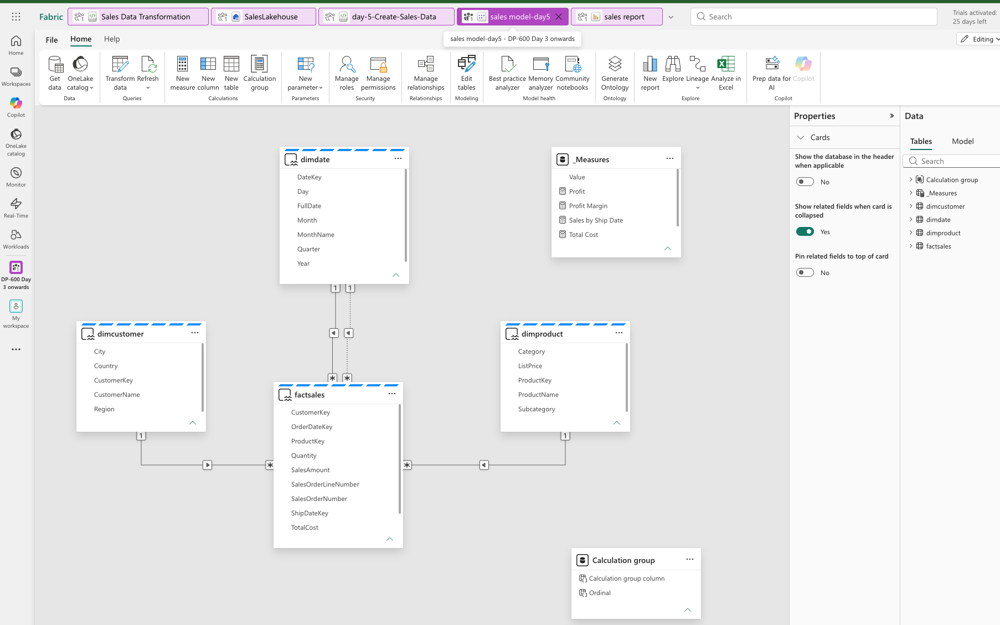

# Microsoft Fabric Boot Camp - Day 5 Notes

**Course:** DP-600 – Implement Analytics Solutions Using Microsoft Fabric
**Topics:** Semantic Models & Storage Modes · DAX Calculations (Calculated Tables/Columns/Measures) · Row & Filter Context · Designing Semantic Models for Scale

---


## Semantic Models - What & Why

A **Power BI semantic model** is a business-friendly logical layer over your data, clear names, defined relationships, and predefined metrics - so analysts drag in "Total Sales" or "Customer Region" instead of writing joins every time. It's built on a **star schema** (normalized facts, denormalized/flattened dimensions).
### Key shift from "classic" Fabric
Previously, creating a warehouse or lakehouse automatically generated a default semantic model. **That no longer happens**, we now create the semantic model as its own deliberate step, choosing exactly which tables to include (you don't have to bring all of them).

### Where DAX fits
- **Power Query (M)** shapes data **before** it lands - this is what Dataflow Gen2's visual editor is, under the hood. It runs at refresh time.
- **DAX** adds logic **after** data is loaded - it runs live, at query time, recalculating as the user filters/slices a report.

---

## Storage Modes for Power BI Semantic Models

| Mode | Data location                                                                       | Speed                                | Freshness | Best for |
|---|-------------------------------------------------------------------------------------|--------------------------------------|---|---|
| **Import** | Copied into memory (the classic Power BI approach, stored in the .pbix)             | Fastest - everything local           | Only as fresh as the last scheduled/manual refresh (Pro = up to 8/day) | Small-to-medium models where some staleness is acceptable |
| **DirectQuery** | Stays at the source; every visual = a live round trip                               | Slower - bound by source performance | Real-time | Operational data where the absolute latest number matters |
| **Direct Lake** | Reads Delta/Parquet files **directly from OneLake**  no copy, no translation to SQL | Import-level speed                   | Near real-time (picked up via lightweight metadata "framing," not a refresh) | Fabric-native data already in Delta format (lakehouse/warehouse) |
| **Composite** | Mixes modes **per table** within one model                                          | Varies by table                      | Varies by table | E.g., historical sales = Import, today's still-changing figures = DirectQuery |

### New semantic models on a warehouse or SQL endpoint default to **Direct Lake**
- Direct Lake reads columns **on demand** - only the columns a query actually needs, not the whole table.
- If a query hits something Direct Lake can't support (check Microsoft's documented limitations), it **falls back to DirectQuery** automatically - unless you explicitly set **Direct Lake *only***, in which case an unsupported query returns **no data at all** (useful for testing that your model stays fully Direct-Lake-compatible).
- **Direct Lake on OneLake** (talks straight to OneLake APIs, including security) vs **Direct Lake on SQL** (routes through the SQL analytics endpoint) - choose the SQL variant only if you need SQL-based row/column/object-level security, or need to reference SQL views rather than raw tables.

> Practical gotcha hit in the demo: a **Direct Lake semantic model cannot be downloaded as a .pbix file** - Power BI Desktop doesn't support Direct Lake locally. To get a downloadable file, you must switch every table's storage mode to **Import** first (via the model's Advanced settings).

---

## 3️⃣ DAX Building Blocks: Tables, Columns, Measures

| | **Calculated table**                                                                        | **Calculated column**                                                                                                       | **Measure**                                              |
|---|---------------------------------------------------------------------------------------------|-----------------------------------------------------------------------------------------------------------------------------|----------------------------------------------------------|
| What it creates | A whole new materialized table                                                              | A new column on an existing table                                                                                           | An **entity** - no physical storage                      |
| Evaluated | Once, as a table                                                                            | **Row by row** (row context)                                                                                                | On the fly, based on filter context                      |
| Stored? | Yes - in memory, adds to model size                                                         | Yes - in memory, adds to model size                                                                                         | **No** - recalculated every time, nothing persists       |
| Classic use case | **Role-playing dimensions** (see below), or an auto-generated calendar via `CALENDARAUTO()` | Simple per-row derived values (e.g. `Sales = Quantity * UnitPrice`) - but prefer doing this in Power Query/upstream instead | Business metrics: Total Sales, Profit Margin, YoY Growth |

### Calculated tables → role-playing dimensions
A single `FactSales` table often has multiple date columns (**OrderDate, ShipDate, DueDate**), but you typically have only **one** `DimDate` table coming out of the gold layer. In the semantic model, you solve this by creating **duplicate calculated date tables** (Order Date / Ship Date / Due Date) - because **a relationship path can only have one active relationship at a time**; the others must be inactive. `CALENDARAUTO()` scans your model's date columns to auto-build a complete calendar table without importing one externally (it also correctly extends to full fiscal years - e.g., a fiscal year ending in June).

### Calculated columns - prefer Power Query instead
Calculated columns are computed **row by row** and stored in memory, and they **recompute in full on every refresh** - there's no way to compute only what changed. Doing the same shaping upstream (Power Query / T-SQL / notebook) avoids this repeated cost. Use `RELATED()` inside a calculated column to pull in a value from a related table via an existing relationship (e.g., getting `UnitPrice` from `DimProduct` into a `FactSales` calculated column).

### Measures - implicit vs. explicit
- **Implicit measure**: dragging a numeric column straight into a visual; Power BI auto-picks an aggregation (sum/avg/count/etc.) that report viewers can silently change - risk of someone averaging a column that should always be summed.
- **Explicit measure**: deliberately authored with a DAX formula (e.g. `Total Sales = SUM(FactSales[SalesAmount])`). Consistent everywhere, and - critically - **explicit measures can reference other measures** (implicit ones cannot), enabling compound metrics: `Profit = Total Sales - Total Cost`, `Profit Margin = DIVIDE([Profit], [Total Sales])`.
- ⚠️ **Implicit measures don't exist in MDX-based models** (e.g., Analyze in Excel / pivot tables) - Excel-facing models need everything explicit.
- **Always use `DIVIDE()` instead of `/`** for ratios - it handles divide-by-zero gracefully (returns a configurable fallback, e.g. 0 or blank) instead of crashing the visual.

---

## 4️⃣ Row Context vs. Filter Context (the conceptual core of the day)

- **Row context** - DAX evaluates one row at a time, only seeing values in *that* row (this is exactly what a calculated column does).
- **Filter context** - determines **which rows are visible in the first place**, before any calculation happens (e.g., a slicer set to one product restricts everything downstream to that product's rows). A **measure** operates entirely within filter context - it's never evaluated per-row and never stored.

### The problem iterator functions solve
If you want a measure like `SUM(Sales[Amount])` but `Amount` doesn't physically exist as a column (only `Quantity` and `UnitPrice` do), a plain `SUM` measure **fails** - you'd normally need to first create a calculated column for `Amount`, which permanently adds it to memory for every row.

**Iterator functions (`SUMX`, `AVERAGEX`, `MAXX`, …) apply row context and filter context in a single formula, entirely in memory, without ever creating a stored column:**
```dax
Total Revenue = SUMX(Sales, Sales[Quantity] * Sales[UnitPrice])
```
This walks every row (row context), multiplies quantity × price, and **sums the result while respecting whatever filter is currently applied** (filter context) - nothing is stored; it recomputes live. This is why the instructor's rule of thumb is: **prefer iterator measures over calculated columns** - same result, no permanent memory cost. (One caveat raised in chat: iterators are compute-heavy, so avoid deeply nesting them.)

---

## Exercise 1 - Create DAX calculations

🔗 **Lab:** [Create DAX calculations in Microsoft Fabric](https://microsoftlearning.github.io/mslearn-fabric/Instructions/Labs/14-create-dax-calculations.html)


This exercise is done in **Power BI Desktop** against a provided starter file (sales analysis with sales, targets, and calendar data), rather than directly in the Fabric web experience. It walks through the concepts covered above hands-on: building a **calculated table** for a role-playing salesperson dimension, generating a proper **date table** with `CALENDARAUTO()` plus fiscal year/quarter/month calculated columns and a drillable hierarchy, creating a mix of **implicit and explicit measures** (average/median/min/max price, order counts) on a sales page, and building a **variance/variance-margin** analysis comparing actuals against targets on a second page - reinforcing why a proper date hierarchy (not just individual year/month fields) is required for drill-down in a matrix visual.

---

## Designing Semantic Models for Scale

### The Direct Lake architecture, top to bottom
```
Lakehouse / Warehouse (Delta tables in OneLake)
        │
        ├── Direct Lake on OneLake  → talks straight to OneLake APIs (incl. security) - simpler, faster, recommended default
        └── Direct Lake on SQL      → routes through the SQL analytics endpoint - needed for SQL-based RLS/CLS/OLS, or to reference SQL views
        │
   Semantic Model  →  Reports, Fabric IQ, AI agents & Copilot
```
Garbage in, garbage out: whatever wasn't set up cleanly in the lakehouse/warehouse in earlier days flows downstream into everything built here.

### Referential integrity (relationship setting)
A checkbox on a relationship between two tables **from the same source** - turning it on tells Fabric to enforce an **inner join** between them. Benefit: potentially faster/more optimized queries. Risk: if keys don't fully match on both sides, non-matching rows are silently excluded - **sales figures can quietly drop** exactly like the inner-join risk covered on Day 4.

### Bridge tables - solving many-to-many
When neither side of a relationship is cleanly one-to-many (classic example: **Students ↔ Courses**, where a student takes many courses and a course has many students), introduce a **bridge/junction table** (e.g. `Enrollment`) with its own key, related one-to-many to *both* sides. This resolves the ambiguity a direct many-to-many relationship would create.

### Role-playing dimensions, solved with `USERELATIONSHIP` (the alternative to duplicating tables)
Instead of creating three separate date tables (Order/Ship/Due), keep **one** `DimDate` table with **one active** relationship and **two inactive** relationships to the same fact table. Activate an inactive one inside a specific measure using:
```dax
Sales by Ship Date = CALCULATE(
    SUMX(Sales, Sales[Quantity] * Sales[Price]),
    USERELATIONSHIP(Sales[ShipDateKey], DimDate[DateKey])
)
```
**Trade-off vs. duplicating tables:** duplicating (3 separate date tables, each with its own active relationship) lets you filter/slice by all three simultaneously in one visual; `USERELATIONSHIP` keeps the model leaner (one table) but you must explicitly write a measure per relationship you want to activate.

### Calculation groups - avoiding a measure explosion
**The problem:** if you need patterns like *Total*, *Month-to-Date*, *Year-to-Date*, and *YoY Growth* across multiple base measures (Sales, Cost, Profit Margin, Boxes shipped, …), the naive approach multiplies out into **dozens of near-duplicate measures** (e.g. 4 patterns × 6 metrics = 24+ measures to maintain).
**The fix:** a **calculation group** defines each pattern (Total, MTD, YTD, YoY%, Last Year, YoY Change) **once**, and it applies across every base measure automatically - maintaining ~6 pattern definitions instead of 50+ measures.

### Other scale-oriented settings 
| Setting | What it unlocks                                                                                                                                                                                              | When you need it |
|---|--------------------------------------------------------------------------------------------------------------------------------------------------------------------------------------------------------------|---|
| **XMLA read-write** (workspace setting; default is read-only) | External tools - Tabular Editor, ALM Toolkit - plus scripted, source-controlled, CI/CD-style model deployment across dev/test/prod                                                                           | Managing a large Direct Lake model the way a professional data team runs source control and repeatable deployments |
| **Query scale-out** | Creat-outes **read-only replicas** of the model so user queries never compete with an in-progress refresh; replicas sync once refresh completes                                                              | Busy, frequently-refreshed models where refresh was previously slowing down active report users |
| **OneLake integration (write-back)** | Takes an **Import-mode** semantic model's tables and writes them back out as Delta tables in OneLake - so notebooks, pipelines, and lakehouse shortcuts can reuse business logic model authors already built | Making model-authored logic reusable by data engineers/scientists downstream, instead of it being locked inside the semantic model only |

---

## Exercise 2 - Design a semantic model for scale

🔗 **Lab:** [Design a semantic model for scale](https://microsoftlearning.github.io/mslearn-fabric/Instructions/Labs/15-design-semantic-model-scale.html)
📄 **My completed file:** *(`sales_report.pbix`)*

Unlike Exercise 1, this one runs entirely in the **Fabric web experience** against a lakehouse (a provided notebook seeds `DimDate`, `DimProduct`, `DimCustomer`, and a 5,000-row `FactSales` table), and it's the concrete, hands-on version of everything the session only demoed conceptually. You build a **Direct Lake** semantic model straight off those lakehouse tables, wire up the star schema with **single-direction, active relationships** and **assume referential integrity** checked (so the engine uses inner joins), and add a **fourth, inactive** relationship on `ShipDateKey` - the role-playing-dimension case from earlier. On top of four explicit measures (`Total Sales`, `Total Cost`, `Profit`, `Profit Margin`), you build an actual **calculation group** (`Time Calculations`) with six time-intelligence items - Current, Year-to-Date, Quarter-to-Date, Month-to-Date, Previous Year, and Year-over-Year Growth - that apply automatically to all four base measures instead of requiring 24 separate ones. A `Sales by Ship Date` measure then uses `USERELATIONSHIP()` to activate the inactive ship-date relationship on demand. The lab closes by turning on **query scale-out** at the workspace level, building a report to prove the relationships/calculation group/role-playing measure all work, and optionally testing **Copilot** against the finished model.

### Query Scale-Out
A **workspace-level setting** on the semantic model (Settings → Query scale-out → toggle On).

- **Problem it solves:** a model refresh competes for the same compute as active report queries. On a busy, widely-shared model, this can visibly slow down or interrupt reports people are looking at *right now*.
- **How it works:** Fabric creates **read-only replicas** of the model. User queries are served entirely from these replicas; a separate read-write copy handles the refresh in the background. Once the refresh completes, replicas sync to the latest data - report users never touch the copy that was mid-refresh.
- **Direct Lake models:** the prerequisite ("large semantic model storage format") is already enabled automatically, so there's no extra setup - just switch it on.
- **When to use it:** models with many concurrent viewers and/or frequent refreshes - not needed for a small model with a handful of users.
---

## Key Takeaways
- **DAX runs after data loads; Power Query/T-SQL/notebooks run before.** Push work upstream whenever possible - reports should do as little heavy computation as possible.
- **New semantic models on a warehouse/lakehouse default to Direct Lake**, with automatic fallback to DirectQuery unless "Direct Lake only" is set.
- **Calculated tables/columns are stored and add to model size; measures are not stored at all.**
- **Prefer iterator functions (`SUMX`, etc.) over calculated columns** for row-level math you only need inside a measure - same result, zero permanent memory cost.
- **Row context = per-row evaluation. Filter context = what's visible before calculation happens.** Iterators apply both simultaneously.
- **A relationship can only be active in one direction at a time** - solve multi-date-role scenarios either by duplicating dimension tables (lets you filter all roles at once) or with `USERELATIONSHIP()` in specific measures (leaner model, less flexible simultaneous filtering).
- **Calculation groups replace dozens of pattern×metric measures with one reusable definition per pattern** - full build next week.
- **Referential integrity and inner joins can silently drop rows** - same caution as Day 4's join discussion, now at the relationship-setting level.

