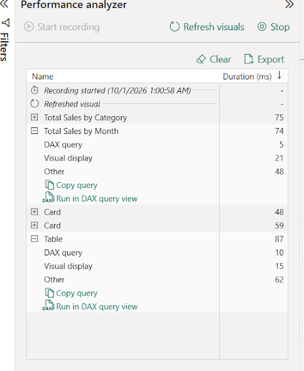
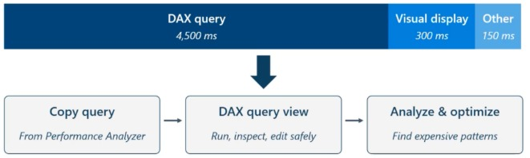
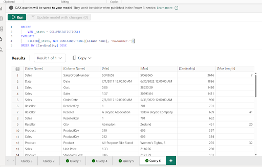
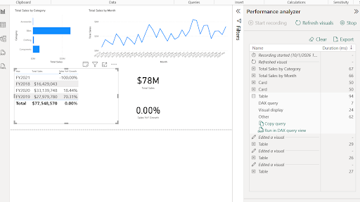
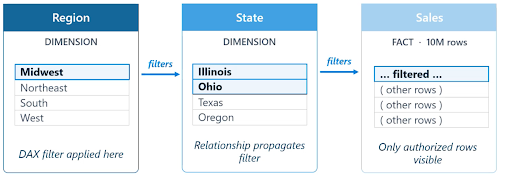

# Microsoft Fabric Boot Camp - Day 6 Notes

**Course:** DP-600 – Implement Analytics Solutions Using Microsoft Fabric
**Topics:** Fabric vs. Power BI Desktop Report Authoring · Optimizing Semantic Model Performance · Row-Level & Object-Level Security (theory)

---


## Fabric Web Reports vs. Power BI Desktop - where do your changes actually go?


| Action | What happens |
|---|---|
| Create a report **directly in Fabric** | Connects **live** to the semantic model - same as opening it via **"Edit in Desktop."** Any new measure you add here modifies the **actual semantic model** everyone shares. |
| **"Edit in Desktop"** from a Fabric semantic model | Also a **live** connection. Changes publish straight back to the same semantic model. |
| Open **Power BI Desktop separately**, then **Get Data → Semantic model**, connect, and build a report | This is an **import of the model for reporting purposes only**. Any new measure you add exists **only inside that report** - it is *not* written back to the shared semantic model, and publishing that .pbix does **not** create a new semantic model item in the workspace either. |

> **Practical implication:** if you want a measure available to *everyone* using the model, add it via Fabric's web editor or "Edit in Desktop." If you build a separate Desktop report against an existing model and add a measure there, that measure is **report-scoped** and invisible to anyone else, even after publishing.

---

## Why Semantic Model Performance Matters

1. **User trust** - a report that takes 10–30 seconds per click quietly gets abandoned; people go back to the spreadsheet they trusted before. All the governance/modeling effort becomes wasted if nobody uses the result.
2. **AI experiences** - Copilot generates DAX queries on the fly from natural language, and those queries are subject to the **same timeouts** as any other query. A badly optimized model doesn't look like "the model is slow" to the end user - it looks like **"Copilot doesn't work."**
3. **Data-driven decisions** - a technically correct report that's too slow to use isn't actually driving any decisions; people either wait too long or act on stale cached numbers.

---

## Performance Analyzer - Workflow

1. **Clear the cache first** - Power BI caches visual/query results, so skipping this step can show falsely instant results.
2. **Start recording**, then interact with the report exactly as a real user would (click slicers, change pages, hit refresh) - Performance Analyzer logs the timing of every visual/interaction, in order.
3. **Find the outlier** - expand each visual's entry to see the breakdown: **DAX query** time (query round-trip to the model), **visual display** time (rendering, images, geocoding), and **other** (background prep, waiting on other visuals).
<p align="center">
  
</p>

**Worked example from the session:** a visual totaling ~4,950 ms broke down as ~4,500 ms DAX query / 300 ms visual display / 150 ms other → **DAX query is ~90% of the total**, so that's where to focus. A 10% improvement on visual rendering (30 ms) is meaningless next to the DAX bottleneck; optimize where the time actually is.
<p align="center">
  
</p>

---

## Common Inefficient DAX Patterns

### Repeated subexpressions
```dax
-- Slow: CALCULATE evaluated twice
Sales YoY Growth =
DIVIDE(
    [Total Sales] - CALCULATE([Total Sales], SAMEPERIODLASTYEAR('Date'[Date])),
    CALCULATE([Total Sales], SAMEPERIODLASTYEAR('Date'[Date]))
)

-- Fast: stored once in a variable
Sales YoY Growth =
VAR SalesPriorYear = CALCULATE([Total Sales], SAMEPERIODLASTYEAR('Date'[Date]))
RETURN DIVIDE([Total Sales] - SalesPriorYear, SalesPriorYear)
```
Same output, but the expensive `CALCULATE` now runs **once instead of twice** - in the live-demo simulation (repeating the pattern 15–20× to exaggerate the effect), this took query time from ~30 ms up to 140–178 ms when reverted back to the unoptimized version.

### `FILTER()` on a full table vs. a native filter argument
```dax
-- Slow: builds a temporary in-memory table by scanning every row
CALCULATE([Total Sales], FILTER(Product, Product[Color] = "Red"))

-- Fast: passed as a boolean directly - no intermediate table materialized
CALCULATE([Total Sales], Product[Color] = "Red")
```

### `COUNTROWS(FILTER(...))` vs. a native `CALCULATE` filter
Same idea - filtering inside a table-scanning function first builds a temporary filtered copy of the table before counting it, versus letting the native filter argument do the work directly against the in-memory column store with no intermediate table.
> **Rule of thumb repeated for both:** never put the filter condition **inside** a table-iterating function if a simpler boolean comparison will do the same job as a `CALCULATE` filter argument.

### Calculated columns/tables vs. Power Query - a decision checklist
Every calculated column/table is **materialized and recomputed in full on every refresh**, directly adding to refresh time and model size. Before adding one in DAX, ask:
- Does it depend on an **existing measure**? → can't be done upstream in Power Query.
- Does it depend on **relationships**? → Power Query has no concept of relationships yet, so this can't be done there either.
- Does it depend on **user filters/slicers** (i.e., something dynamic per viewer)? → must stay in DAX as a measure.
- **If none of the above apply** (e.g., a static "Full Name" concatenation) → push it **upstream into Power Query** instead. It computes once at refresh time rather than repeatedly at query time, and keeps the semantic model faster.

---

## Cardinality

**Cardinality = the number of distinct unique values in a column** - one of the biggest levers on model performance and memory. Numbers store and compress efficiently; a column full of unique text/strings behaves like an "index card" system the engine has to look up every time, which is slower and heavier the more distinct cards exist.

**Techniques to reduce it:**
1. **Remove unused columns entirely** - if a column isn't used for relationships, security rules, filtering, grouping, or summarizing, it's pure overhead.
2. **Truncate datetime to date** - a timestamp with second-level precision can have nearly one unique value per row; collapsing to a single value per calendar day is a huge cardinality win if the business doesn't need finer granularity. (If they genuinely need second-level freshness, that's a case for **Eventhouse/real-time dashboards**, not a semantic model.)
3. **Bucket continuous values** - e.g., group raw ride durations (5 min, 5.5 min, 5 min 45 sec…) into fixed buckets (5–10 min) to collapse many distinct values into a handful.
4. **Optimize data types** - e.g., strip a text prefix like `SO123456` down to a pure whole number `123456`; moves the column from an expensive text-lookup structure to fast native number storage.

**Diagnosing it live:** the `COLUMNSTATISTICS()` DAX function (run in DAX query view) returns cardinality per column across the whole model - the fact table (`Sales`) dominated the top of the list in the demo, since it has the most rows and the most distinct measures/keys; dimension tables (`Product`) stayed comparatively low.

<p align="center">
  
</p>

---

## Aggregations - Pre-Summarizing Large Tables

| | User-defined aggregations | Automatic aggregations |
|---|---|---|
| Approach | Manual - build a separate, smaller summary table (e.g., sales pre-grouped by product/customer/month) using `SUM`/`COUNT`/`GROUP BY`, then wire it up via **Manage aggregations** so matching queries are served from it instead of the full detail table | Power BI keeps a rolling **7-day log** of every query sent to the model; a machine-learning process detects recurring column/filter combinations and **automatically builds and maintains** in-memory aggregation tables, adjusting as query patterns shift |
| Control | Full control over grain and column mapping | Hands-off - no manual table design |
| Availability | Any capacity | **Premium / Fabric capacities only** |
| Fallback | N/A (you built it) | If a query doesn't match an existing aggregation, it falls back to the detail table (potentially DirectQuery) |

---

## Exercise 1 - Optimize semantic model performance

🔗 **Lab:** [Optimize semantic model performance](https://microsoftlearning.github.io/mslearn-fabric/Instructions/Labs/16-optimize-semantic-model-performance.html)

Runs in **Power BI Desktop** against a provided AdventureWorks starter file that deliberately contains an inefficient measure. It's a hands-on run of the exact diagnostic loop covered above: capture a **Performance Analyzer** baseline on a table visual, export its generated DAX query into **DAX query view** to inspect it, find that the `Sales YoY Growth` measure evaluates the same `CALCULATE(..., SAMEPERIODLASTYEAR(...))` expression twice, rewrite it using a `VAR`, confirm the values are unchanged via a query in DAX query view, then re-run Performance Analyzer to verify the (likely small, since this dataset is tiny) improvement. It closes with a `COLUMNSTATISTICS()` pass to see which columns carry the highest cardinality in the model - expect the fact table's transaction ID and numeric measure columns at the top, dimension keys/labels near the bottom.

<p align="center">
  
</p>

> Note from the session: with a dataset this small, the *absolute* millisecond difference before/after may barely register - the point of this exercise is the **process** (measure → diagnose → fix → verify), not a dramatic before/after number.
> Optimizing Sales YoY formula reduced query time from 10ms to 7ms as seen in the image above.
---

## Row-Level Security (RLS) - Theory

### How RLS actually applies through a model
RLS is written as a **DAX filter on a dimension table**, then propagates **outward through active relationships** - it is not written directly against the giant fact table (that would mean filtering tens of millions of rows with a DAX expression on every query, which is expensive). Example flow: a rule restricts a `Region` dimension to "Midwest" → the region-to-state relationship means the user only sees Illinois and Ohio → the state-to-sales relationship means they only see sales rows for those states.
<p align="center">
  
</p>

**Two hard requirements:**
- RLS only works through **active** relationships - **inactive relationships are ignored by RLS entirely**, and there's no `USERELATIONSHIP`-style workaround to make it respect one.
- The relationship connecting the secured dimension to the fact table must exist and be active - without it, the filter has nothing to propagate through.

### Static RLS
**One role per distinct value**, hardcoded directly into the role's DAX filter (e.g., a "Midwest" role with `Region[Region] = "Midwest"` baked in), with people assigned into whichever role matches their permitted region.
- Simple, no dynamic lookup required.
-  **Doesn't scale**: the number of roles always equals the number of distinct values you're securing - 10 regions means 10 roles; 100 regions means 100 roles.
- **Fragile to change**: renaming, splitting, or adding a partition value means editing the model and republishing a rule.
- **When it's the right choice:** a small, stable, rarely-changing set of values (e.g., a handful of regions that haven't changed in years).

### Dynamic RLS
Instead of one role per value, write **one role** using `USERPRINCIPALNAME()` - a DAX function that returns the logged-in user's identity (via Microsoft Entra ID) - matched against a **mapping table** (e.g., `DimUser`) that stores which values each user's email is allowed to see.
- Scales to any number of values - adding a new region or changing someone's access is just **updating a row in the mapping table and refreshing**, no model changes or republishing.
- A person can be granted access to **multiple values** at once (e.g., both "Midwest" and "Southwest") via multiple rows in the mapping table.

---

## Object-Level Security (OLS) 
Restricts access to an entire **table** or a specific **column**, rather than filtering rows. Classic example: an HR salary column that only HR should see, while everyone else can see the rest of the employee table.

- **Two granularities:** restrict a whole table (e.g., a sensitive performance-review table nobody outside HR should even know exists) or restrict just one column within an otherwise-visible table (e.g., hide `Salary` but leave `EmployeeName`, `Department`, etc. visible).
- ⚠️ **Cannot break a relationship chain**: if Table A relates to Table B, which relates to Table C, you **cannot** apply OLS to a key column in Table B that's needed for that A→C relationship path - Fabric blocks you from even creating the rule at design time, because doing so would sever the path a query needs to travel.
- ⚠️ **No portal/no-code UI** - OLS can currently only be configured by directly editing the **TMDL** (Tabular Model Definition Language) view of the semantic model; there's no drag-and-drop equivalent the way there is for RLS role rules.
- ⚠️ **OLS blocks the underlying data, not the visual** - if a report visual still has the restricted column/measure placed on it, a user without access sees an error rather than the report "just working" without that field. You must **also build a version of the report with that field removed** for the restricted audience - practically speaking, this usually means a **separate report page or a separate report entirely** for a restricted group like HR.

---

## Operational Rules for RLS & OLS (easy to get wrong)

1. **Workspace role must be Viewer** - if a person has **Member or Contributor** access to the workspace, RLS/OLS **will not apply to them at all**, because that level of access implies they can edit the report/model directly, bypassing the point of the security rule.
2. **No Power BI Desktop UI for OLS** - must be configured online (via TMDL); RLS role rules *can* be created in Desktop, but assigning users to roles is done online.
3. **Assign roles through Entra security groups, not individual users** - an admin manages group membership; when someone joins, leaves, or moves teams, the admin only updates group membership once, and Power BI automatically reflects it everywhere the group is used as a role assignment. Adding users one by one doesn't scale to a large organization.
4. **Verify with "View As" (Test as role)** - lets you preview a report exactly as a member of a given role would see it, without actually being that person.
5. ⚠️ **"View As" does not fully validate every consumption path** - per Microsoft's own documentation, it does **not** reliably validate.
---

## Note: Semantic model Security hands-on exercise is on next workshop

---

## Key Takeaways
- **Fabric web reports and "Edit in Desktop" both write live to the shared semantic model; a separately opened Desktop report connecting via "Get Data → semantic model" does not** - its new measures stay local to that one report.
- **Performance Analyzer's 3-step loop (clear cache → record → find the outlier) plus "Copy query → DAX query view"** is the standard diagnostic path for a slow report - always chase the largest bucket of time (usually the DAX query), not visual rendering.
- **Store repeated `CALCULATE`/subexpressions in a `VAR`** - this alone was demonstrated to be the difference between ~30 ms and 140–178 ms in an exaggerated live test.
- **Never filter inside a table-iterating function (`FILTER`, `COUNTROWS(FILTER(...))`) when a native `CALCULATE` filter argument will do** - the former materializes a temporary table; the latter doesn't.
- **Calculated columns/tables recompute in full on every refresh** - push logic upstream to Power Query whenever it doesn't depend on a measure, a relationship, or a user filter.
- **Cardinality is one of the biggest performance/memory levers** - remove unused columns, truncate datetime precision, bucket continuous values, and prefer numeric over text encodings; `COLUMNSTATISTICS()` shows exactly where the cost lives.
- **RLS propagates outward from a dimension through active relationships only** - inactive relationships are invisible to RLS, with no `USERELATIONSHIP`-style escape hatch.
- **Static RLS** = simple but doesn't scale (roles = number of distinct values). **Dynamic RLS** (`USERPRINCIPALNAME()` + mapping table) = one role, scales indefinitely, updated by editing data rather than the model.
- **OLS restricts access to the data, not the visual** - a restricted field left on a report still breaks for the restricted user; you need a version of the report without that field for them.
- **RLS/OLS require Viewer-level workspace access to apply at all**, must be assigned via security groups (not individuals) for manageability, and should be verified with real user sign-ins - not just "View As" - for Copilot/Q&A/Quick Insights specifically.

## Follow-up / To Revisit
- **Day 7:** Hands-on lab for RLS/OLS (theory-only today) - but note the **object-level security demo specifically won't be repeated** in tomorrow's lab, so the recording is the only walkthrough of that part.
