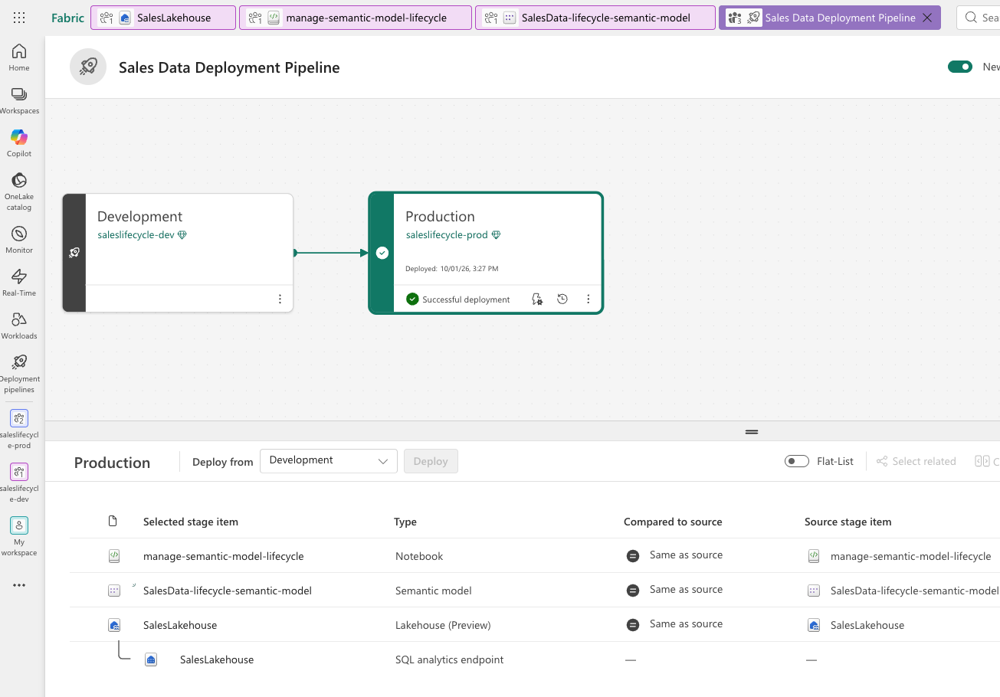

# Microsoft Fabric Boot Camp — Day 7 Notes

**Course:** DP-600 – Implement Analytics Solutions Using Microsoft Fabric
**Topics:** RLS/OLS Hands-On (completing Day 6's theory) · Managing the Semantic Model Development Lifecycle · Preparing a Semantic Model for Copilot/AI

---

## A Critical RLS/OLS Insight, Demonstrated Before the Lab

- **A field merely hidden in a report** (not secured with OLS) is **still visible to Copilot**. In the demo, a hidden `ProductKey` column didn't appear anywhere in the report visuals, but asking Copilot *"what is the product key of [product]?"* **returned the value anyway** — Copilot queries the underlying model, not just what's placed on the canvas.
- Only after **OLS** was applied to that same column did Copilot respond *"I don't see any column in your data model that stores a product key."*
- **Takeaway:** report design (hiding a field visually) and data security (RLS/OLS) solve two different problems. Design hiding protects against a badly laid-out report; it does **nothing** to stop Copilot, Q&A, or anyone with raw model access from reaching that data. **Only OLS actually removes a field from what's queryable.**

---

## Exercise — Enforce Semantic Model Security (RLS & OLS)

*(https://microsoftlearning.github.io/mslearn-fabric/Instructions/Labs/17-enforce-model-security.html theory for this topic is in `Day6_SemanticModel_Optimization_&_security`)*

Run in **Power BI Desktop** against a provided star-schema report (`SalesTerritory`, and a `Region` column holding AdventureWorks sales regions).

**Worth knowing in advance:**
- **"View As" only exists in Power BI Desktop** — in the Fabric web experience, the equivalent is under the semantic model's **Security** settings → **Test as role**.

---

## Managing the Semantic Model Development Lifecycle

> **Framing for this whole section:** once a model has DAX, security, and real users, it has to be treated like software — versioned, tested, deployed, and monitored — the same discipline a software team applies to code, now applied to a semantic model.

### The continuous 4-stage loop

  

This loop **never ends** — new requirements keep arriving, so it's iterative by design, not a one-time setup.

### Reusable assets: two different problems, two different fixes
| Asset | Solves | How |
|---|---|---|
| **Shared semantic model** | **Inconsistent numbers** — everyone building their own "revenue" definition | One scaled modeler builds and publishes a single model; everyone else connects **live** (Power BI, Excel, new reports) — change the definition once, every connected report updates |
| **Power BI Template (.pbit)** | **Inconsistent report structure** — everyone rebuilding the same layout from scratch | A `.pbix` with queries/model/layout but **no data** — gives new report authors a running start, enforces branding/visual standards, ships reusable DAX patterns (e.g. a YoY calculation), and carries **zero risk of leaking data** since none is embedded |

### Version control: PBIX vs. PBIP
- A `.pbix` is a **single binary file** — when a teammate changes it and saves, you have **zero visibility** into what changed.
- **PBIP (Power BI Project)** saves the same report as a **folder of text files** instead: a semantic model folder (with per-table **TMDL** — Tabular Model Definition Language — files for relationships/measures/structure) and a report folder (JSON), plus a `.gitignore`. Because it's text, it can now go through a **real Git workflow**.

**The workflow, as demonstrated (Power BI Desktop → VS Code → GitHub):**
1. Author locally in Desktop; save as **PBIP** instead of PBIX.
2. Open the PBIP folder in an IDE (VS Code in the demo) connected to a GitHub repo.
3. Every change (a new measure, a moved field) shows up as a **diff** in source control — exactly the visibility a `.pbix` can't give you.
4. Commit → push to a **feature branch** → open a **pull request** → a teammate reviews the diff → merge to main.
5. **Easy to miss:** merging the PR only updates the **Git repository** — someone still has to go back into the Fabric/Desktop workspace's source control pane and select **Update** to actually pull those merged changes into the live items.

**The same pattern, at workspace scale, in Fabric:**
- Under **Workspace settings → Git integration**, connect the **entire workspace** (not just one semantic model) to a repo using a **fine-grained personal access token** scoped to that one repository with read/write access.
- Every item type is covered this way, not just semantic models — **warehouses, lakehouses, notebooks** (each notebook becomes a `content.py`/similar text file), **dataflows**, and reports all show up as **synced** or **uncommitted** depending on whether local changes have been committed.
- Same commit → branch/PR → merge → **Update** flow as the Desktop/GitHub example above.

---

##  Validate: SemPy + XMLA

- **SemPy** (the semantic link library) runs **inside a Fabric notebook** and talks directly to a semantic model in Python: list tables/measures, inspect metadata, check for **orphaned foreign keys**, and — critically — **evaluate real DAX queries and compare the result to a known expected value programmatically**, instead of manually clicking through report pages to eyeball whether a number looks right.
- **XMLA read/write** is the other validation tool — it's what lets **external tools** (Tabular Editor, best-practice-rule checkers, a scripted DevOps pipeline step) connect to and inspect or modify the model structure **outside** the Fabric/Power BI UI entirely.

📄 **The full hands-on SemPy walkthrough (list tables → check nulls/duplicates/orphans → evaluate a broken DAX query → fix via `connect_semantic_model`/TOM → re-verify) is documented separately as the Exercise below — see also the markdown summary already added to the lab notebook.**

---

## Exercise — Manage the Semantic Model Lifecycle

🔗 **Lab:** [Manage the semantic model lifecycle](https://microsoftlearning.github.io/mslearn-fabric/Instructions/Labs/21b-manage-semantic-model-lifecycle.html)
📓 **My completed notebook:** `manage-semantic-model-lifecycle.ipynb` (includes a **Validate → Fix → Deploy** summary markdown cell at the end)

This is the hands-on version of the SemPy validation concept above, plus the deployment pipeline section below, done together in one notebook + two workspaces (`-dev` / `-prod`). Full detail (what was checked, what was found, how it was fixed) is written up as the markdown cell appended to the notebook itself rather than duplicated here — see that file for the complete walkthrough.

---

## Deploy: Deployment Pipelines

- A pipeline needs **at least two stages** (commonly Development / Test / Production — the lifecycle exercise above uses just Development/Production); **each stage is a separate Fabric workspace**.
- **Deploy is a one-click promotion** — it compares source vs. target, shows exactly which items differ, and overwrites the target with the source version for whatever you select.
- **Deployment rules** let specific settings (a connection string, a parameter) **change automatically** as content moves between stages — e.g. so Production always points at the real data source instead of silently inheriting Dev's test database. (Live Q&A confirmed: deployment is **all-or-nothing per item** — there's no way to promote just part of a warehouse; the workaround for partial promotion is to split that content into a **separate warehouse** and use shortcuts back to the original.)
- **Deletion behavior, discovered live:** deleting an item in Development and redeploying does **not immediately delete** the corresponding item in Production — it enters a **retention period** first rather than being hard-deleted on the spot. (The instructor was candid that this wasn't something they'd fully verified beforehand — worth testing/confirming in your own environment rather than assuming a specific retention length.)

  

---

## 5️⃣ Maintain: Refresh, Orchestration & Monitoring

| Mechanism | Purpose | Key detail |
|---|---|---|
| **Scheduled refresh** | Keeps a standalone semantic model current | Power BI **Pro**: up to **8 refreshes/day**. **Premium/Fabric capacity**: up to **48/day**. Schedule during **off-peak hours** — refreshes consume capacity that would otherwise go to active report users. Configure **failure alert emails** (can include a support distribution list) so a failed refresh doesn't go unnoticed. |
| **Data Factory orchestration** | Handles **dependencies** a simple schedule can't — e.g. don't refresh a report until an upstream data load has actually finished | Supports **conditional logic**: if the upstream step fails, skip the downstream refresh entirely rather than refresh against incomplete/broken data ("garbage in, garbage out" — stated explicitly in the session). Sends a notification once the **whole chain** succeeds, not just one piece. |
| **Monitoring hub** | One centralized view instead of checking 10 separate items' refresh histories | Shows running/succeeded/failed jobs across semantic models, dataflows, pipelines, and notebooks, filtered to whatever you have permission to see. |

---

## Preparing a Semantic Model for Copilot / AI

> **Demo only, not a hands-on requirement for trial users.** This module's lab needs a **paid Fabric capacity** — Copilot doesn't function on trial capacity — so the instructor demonstrated it live rather than assigning it as an exercise. Included here for completeness since it's official DP-600 content.

### Grounding — the step that makes Copilot trustworthy instead of generic
Before Copilot can answer a question about your data, it has to understand your data — this is **grounding**, and it's what separates a generic chatbot from one giving answers rooted in your actual model.

**The 5-step flow:** user's natural-language prompt → **grounding** (Copilot pulls contextual metadata from your semantic model) → augmented prompt (your question + retrieved structured context) → AI-generated response → a filtering layer before the answer reaches you.

**What grounding actually reads from your model:** table/column names, **descriptions** you've written (only the **first ~200 characters** are prioritized — keep them concise), data types, **relationships** (so it knows how Sales connects to Product/Date), **measures** (so it reuses your existing DAX instead of guessing new logic), linguistic schema (synonyms/terminology), and **data category** (so it knows a field is a geography, URL, barcode, etc. and handles it appropriately).

**This is Retrieval-Augmented Generation (RAG), not training** — explained with an open-book-exam analogy: the model doesn't memorize your data between questions; it "opens the books" (your tables) fresh for every question, extracts what's relevant, reasons over it, and then has no memory of it afterward. **Hidden fields and OLS-restricted fields are excluded from grounding entirely** — consistent with the RLS/OLS demo in section 1.

**Depending on the destination, grounding generates different native code under the hood:** Python/Spark for a lakehouse, **T-SQL** for a warehouse, **KQL** for a KQL database — the data agent topic for tomorrow.

### Why naming/description quality directly drives AI accuracy
A table named `sales_V2` is technically valid but meaningless to both an AI model and a new business user — "what does V2 even mean?" **Clear, entity-oriented names** (`Sales`, `Product`, `Date`, `Customer`) plus concise descriptions materially improve how well Copilot can ground itself, the same way clear documentation helps a new human teammate.

### The three configurable layers in "Prep data for AI"
| Layer | Controls | Example from the live demo |
|---|---|---|
| **AI data schema** | Exactly which tables/columns Copilot is allowed to see at all — hide surrogate keys, ETL columns, anything not meant for business consumption | Removed `CustomerKey`/`ProductKey`/`SalesOrderLineNumber`/`SourceSystem` from the simplified schema; kept `CustomerName`, `Category`, `TotalSales`, etc. Fewer exposed fields = faster, more accurate retrieval. |
| **Verified answers** | Locks a **specific, pre-approved visual** to a trigger phrase (plus its synonyms) so a common question always gets a deterministic, instant answer instead of Copilot regenerating a fresh query every time | "Show me the total sales" / "Show me the total revenue" / "How much did we sell" all mapped to one verified card visual. |
| **AI instructions** | Free-form business context — the "system prompt" layer — telling Copilot things it can't infer from schema alone (how your org defines a term, scope boundaries, what it should/shouldn't answer) | *"Revenue and sales refer to the Total Sales measure. Products are organized by category and subcategory. Use 'top products' to mean ranked by total sales, descending."* (The instructor noted you can even have Copilot itself draft this text from a screenshot of your model.) |

- **Approved for Copilot** is a separate settings flag on the semantic model — it's the organizational signal that a model has been reviewed and is ready for AI consumption, not just technically configured.
- **Synonyms** configuration (previously under the Modeling ribbon's Q&A setup) is **being retired in December 2026** and was skipped in the live demo for that reason — don't invest time setting it up going forward.

### The bigger picture: Fabric IQ / Foundry IQ / Work IQ
Everything configured here (schema, verified answers, instructions) isn't just for the Power BI Copilot pane — it's an investment that feeds **three layers** Microsoft is building toward:
- **Fabric IQ** — AI understanding of your structured Fabric content (this semantic model, tomorrow's ontology).
- **Foundry IQ** — broader enterprise knowledge (SharePoint, OneDrive, Azure AI Search, Blob Storage).
- **Work IQ** — the Microsoft 365 Copilot layer that understands organizational context (who you work with, communicate with).
> Once your model is properly surfaced here, **any Fabric data agent anyone in the org builds** can connect to it immediately — framed explicitly as a reason to get naming/descriptions/security right *now* rather than retrofitting later.

### Validating AI readiness — also an iteration loop
Test with the kinds of questions real users will ask → identify wrong/unexpected answers → trace the issue (every Copilot answer shows **"Explore Answer"**, exposing the actual query it generated, plus downloadable diagnostics) → fix the model → retest. Same "it never really ends" framing as the lifecycle loop in section 2.

---

## Key Takeaways
- **Hiding a field in a report ≠ securing it.** Copilot and raw model access both bypass visual hiding; only **OLS** actually removes a field from what's queryable.
- **Dynamic RLS needs `USERPRINCIPALNAME()` + a mapping table with a cross-filter direction of Both** to the secured dimension — confirmed necessary in this session's live lab, not just theoretical.
- **PBIX = binary, no diff visibility. PBIP = folder of text/TMDL files = real Git version control.** The same text-based approach extends to an entire Fabric workspace (semantic models, warehouses, lakehouses, notebooks, dataflows all become diffable).
- **Merging a pull request only updates the Git repo — someone still has to hit "Update" in the workspace's source control pane** to actually apply those changes to the live items.
- **SemPy + XMLA turn semantic model validation into repeatable, scriptable, scheduled tests** — instead of manually re-checking every report after a change.
- **Deployment pipelines promote all-or-nothing per item** (no partial-table promotion); use **deployment rules** to keep environment-specific settings (like data source) correct automatically on every deploy.
- **Deleting an item in Dev and redeploying doesn't hard-delete it in Prod immediately** — it goes through a retention period first.
- **Scheduled refresh (simple, periodic) vs. Data Factory orchestration (dependency-aware, conditional)** — pick based on whether your refresh genuinely needs to wait on an upstream step succeeding first.
- **Grounding is RAG, not training** — your data is read fresh per question and never retained by the model between conversations; hidden/OLS'd fields are excluded from grounding, same security boundary as the Copilot demo in section 1.
- **The first ~200 characters of a description are what grounding prioritizes** — write them concisely and meaningfully, not as filler.
- **AI data schema, verified answers, and AI instructions are three distinct, complementary controls** — schema = what Copilot can see, verified answers = deterministic responses to known questions, instructions = how it reasons about everything else.
