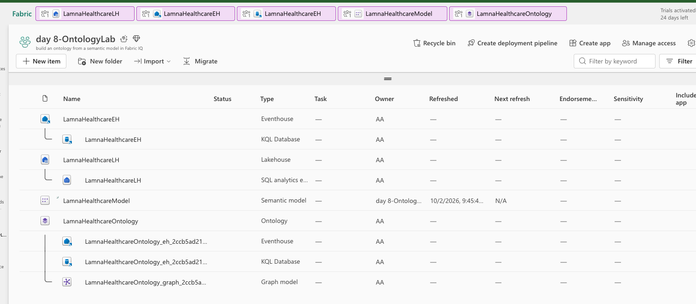

# Microsoft Fabric Boot Camp  Day 8 Notes

**Course:** DP-600 – Implement Analytics Solutions Using Microsoft Fabric
**Topics:** Building an Ontology with Fabric IQ · Graph Data & GraphQL · Implementing Fabric Data Agents

---

## Framing for the day: reactive vs. proactive AI

Everything up through Day 7 (Copilot in Power BI, a semantic model prepped for AI) is **reactive**  a person looks at a dashboard, notices a problem (e.g., declining sales), and *then* has to go ask around to understand why. That back-and-forth (asking the CFO, who asks the sales team, who asks marketing) is slow and fragmented  there's no 360° view.

This session introduces two upgrades to that model:
1. **Ontology**  gives an agent deep, *structural* understanding of your entire data estate (not just whatever's on a report canvas), including the relationships between things.
2. **Fabric Data Agent**  can also be **proactive**: continuously watching live/streaming data (e.g., the bike-rental Eventstream from Day 2) and surfacing an alert  *"bike points 6, 7, 9 have no bikes available"*  before anyone thinks to ask.

---

## What Is an Ontology?

> *"A way to give your organization's data a shared, standardized meaning"*  regardless of whether you generate it from a semantic model, build it manually from OneLake, or some mix of both. Every ontology is built from the same **4 universal building blocks**.

| Building block | What it is | Example |
|---|---|---|
| **Entity type** | A business concept, standardized org-wide so every team works from the same definition instead of conflicting table-by-table interpretations | `Hospital`, `Department`, `Patient`, `Product`, `Customer`  a company could even rename "Customer" to "Buyer" if that's their internal term |
| **Property** | A declared attribute of an entity, with a **data type that must match the underlying table's type** (names don't have to match, but types do) | `HospitalName` (string), `Floor` (integer) |
| **Entity type key** | A unique identifier (string or integer)  **required before any data can be bound** | `HospitalID`, `PatientID` |
| **Relationship** | A **directional** connection between two entity types | `Hospital` *contains* `Department` |

Properties can be **static** (rarely changes  a name, a location, an ID) or **time series** (tracks values that change over time, like a sensor reading)  and this distinction matters because time series properties are **not** bound automatically the way static ones can be.

### Data binding  connecting the concept to real tables
Binding is what maps an ontology concept to an actual table/column in your source data  **the link between a business concept and the messy real-world table underneath.**

| Binding type | Comes from | Rule |
|---|---|---|
| **Static** | **Lakehouse tables only** (confirmed live: **warehouses cannot be bound directly**  only lakehouses and Eventhouses are currently accepted) | Each entity type can have **only one** static binding, from **one table**  you can't mix static data from two different sources for the same entity type |
| **Time series** | Eventhouse streams (or a lakehouse table that an Eventstream has landed data into) | An entity type **can** pull time series data from more than one source; always carries a timestamp |

⚠️ **Order matters: entities must be bound with static data *before* time series data can be added**  the time series data is the transactional/event layer sitting on top of the "who/what" the static binding already defined (the same conceptual split as fact vs. dimension tables).

---

## Generating an Ontology from a Semantic Model

Two paths exist: **generate from an existing semantic model** (fastest  today's focus, reuses modeling work already done) or **build manually from OneLake** (full control from scratch). 
- Tables → entity types
- Columns → properties (sometimes keys are detected too)
- Relationship **types** are created (the named connections, e.g. "Hospital contains Department")

**What it does *not* do automatically** (you must finish manually  confirmed live, with real errors hit along the way):
1. **Rename for business language**  generated entity types keep technical table names (`DimProduct`, `FactSales`) and need renaming to plain terms (`Product`, `Sales`). *Better to rename upstream in the semantic model itself before generating, to avoid double work.*
2. **Verify/assign entity type keys**  especially on fact-style tables with many candidate keys, where the system can get confused about which one is the actual unique identifier.
3. **Configure relationship *data* bindings**  generation creates the relationship **type** (the concept/name) but **not** the actual binding to real data; you must map the source table/columns for each relationship yourself.
4. **Add time series bindings**  never created automatically from a semantic model; added manually, connecting to an Eventhouse table with a timestamp column and a linking key.
5. **Only works fully if the semantic model is in Direct Lake mode, with the lakehouse behind it allowing inbound public access.** In Import or DirectQuery mode, you still get entity types/properties/relationship types, but **no automatic data bindings**  all of it must be added by hand.

**Worth knowing in advance:**
- A **data-type mismatch** (e.g., the table's `ListPrice` is `decimal` but the auto-generated property was typed as `integer`) throws an error on binding  the fix was to **delete and recreate the property** with the correct type; there's **no "update metadata" option to just change a property's type** (confirmed live  the three-dot menu's edit option doesn't allow a type change).
- **Renaming a property after it's already bound can break the binding** (observed live, attributed to the feature being in preview)  if this happens, remove and redo the binding rather than assuming your setup is wrong.
- **Remove any RLS role-playing dimension table** (like a `DimUser` mapping table) from the ontology entirely  you don't want that exposed as a queryable entity.
- A good upstream semantic model (clean names, complete relationships, well-defined keys) directly reduces ontology cleanup  **the two are linked, not independent tasks.**

### Ontologies scale flexibly across workspaces and sources
- One ontology can live in a **different workspace** than the semantic model it was generated from.
- An organization can have **multiple ontologies**, each pointing at a different semantic model (or none at all).
- A single ontology's entities **can each bind to tables in different lakehouses, in different workspaces**  there's no requirement that everything come from one place.

---

## The Payoff: Graph Data & GraphQL

Once an ontology is generated, Fabric automatically creates a **lakehouse** (with its SQL analytics endpoint) **and a graph model** behind it  the graph is the actual reason to do any of this work.

**What a relationship graph gives you that tables don't:**
- A traditional semantic model/warehouse requires you to **know the joins ahead of time**. A graph lets an **agent dynamically traverse connections it wasn't explicitly told about**  discovering context on the fly.
- Graph-native questions tables can't easily answer: *"Which customers bought products that were also bought by customers?"*, *"Show all managers above employee X"*, *"What's the shortest path connecting Customer A to Customer B?"*
- Querying is done through the **no-code/low-code query builder** (point-and-click joins/filters across entities) which generates the underlying **GraphQL** automatically  or you can write GraphQL directly.

**Graph Query Language (GQL)**, mentioned alongside this: when a data agent's answer comes from a **semantic model/ontology with graph data**, the AI generates a **graph query** rather than SQL/DAX/KQL  described as visually similar to **Neo4j's Cypher** language (Neo4j being referenced as the dedicated graph-database platform this pattern is modeled on).

---

## Exercise 1  Build an Ontology from a Semantic Model

**Lab:** [Build an ontology from a semantic model](https://microsoftlearning.github.io/mslearn-fabric/Instructions/Labs/24-build-ontology-semantic-model.html)

  

> Works on a **Fabric trial** capacity  unlike the data agent exercise below.

Built around a **healthcare scenario** (`Lambda Healthcare`)  hospitals, departments, patients, rooms, and vital sign equipment, with streaming vital-sign readings landing in an Eventhouse. The lab has you create a lakehouse (upload 5 CSVs: hospitals, departments, patients, rooms, vital-sign-equipment), an Eventhouse with a vital-signs-readings table, then a semantic model spanning **multiple lakehouses/warehouses at once** , wire up the star-schema relationships (**all set to cross-filter direction Both**  noted as unusual but required here), then generate and refine the ontology exactly per the process in section 2 above: rename entities, verify/assign every entity type key (the `VitalSignEquipment` entity was missing one and needed it added manually), bind every relationship (one  `VitalSignEquipment → Patient`  needed manual binding, the rest auto-bound since this ontology came from lakehouse tables directly rather than via table shortcuts), and finally add the **time series binding** on `VitalSignEquipment` pointing at the Eventhouse's readings table (heart rate, oxygen saturation, respiratory rate, body temperature).

**Before starting, two admin settings must be enabled** (Trial capacity users are their own admin):
- **Admin portal → Ontology** setting enabled.
- **Admin portal → Agent settings**  the 5 "users can use/create AI agents, allow data outside region" toggles enabled. 
> **Note on the graph/GraphQL query step:** the official lab itself **does not include the graph exploration part**  the instructor added it as supplementary teaching, querying the generated graph via the no-code query builder (filtering `Department` name contains *"Intensive"*) to show the relationship graph live. Worth doing yourself even though it's outside the lab's written steps, since it's the actual payoff described in section 3.

---

## Fabric Data Agents

A Fabric Data Agent lets anyone ask a plain-English question (*"What is the average age of patients with diabetes?"*) and get a real answer pulled from actual data, with **zero SQL/DAX/KQL knowledge required.**

### How it decides what to query
1. **Reasons over multiple source types at once**: Power BI semantic models, Eventhouse/KQL databases, lakehouses, warehouses, and **Fabric ontologies**  up to several connected simultaneously.
2. Looks at the question and **picks the best-fit source** behind the scenes.
3. **Generates native code matching that source**: Python/SQL for a lakehouse, **T-SQL** for a warehouse, **KQL** for a KQL database, or a **graph query (GQL)** when the source is an ontology with graph data.
4. Runs the query, then returns a **coherent, human-readable response** (not just a raw number)  the underlying generated query and its result are both inspectable via "steps completed."

### Can you create a data agent without an ontology?
**Yes**  you can connect it directly to lakehouse/warehouse tables and it will generate queries against them. **But an ontology gives the agent the graph**  without it, the agent still has to work out table relationships on its own, the same limitation as any non-graph AI tool. 

### Publishing & consuming a data agent
- **Draft vs. published**: new edits create a draft that doesn't affect the currently published version  safe iteration.
- **Row-level security carries through**: RLS set up at the semantic-model layer only covered that layer; you can **also** apply security at the lakehouse and warehouse level so the **data agent honors those same permissions** when answering questions.
- **Consumption surfaces:**
  - **Microsoft Foundry**  add the data agent as a **knowledge source** for a Foundry agent. Requires the data agent's **workspace ID and artifact ID**, found via the data agent's publishing details → **MCP server URL**.
  - **Copilot Studio**  add as a connected tool to a custom Copilot Studio agent.
  - **Power BI**  use Copilot search to find and manually add a data agent into an existing Copilot session, the same way a semantic model/report can be manually added.
  - A **separate "operations agent"** pattern exists (can take actions, not just retrieve data)  **deferred to Day 9**, not covered today.

### ⚠️ Data agents require a paid Fabric capacity
>  The data agent is not available for trial capacity... 

---

## Exercise 2  Implement a Fabric Data Agent

**Lab:** [Chat with your data using Microsoft Fabric data agents](https://learn.microsoft.com/en-us/training/modules/implement-fabric-data-agents/exercise-copilot-fabric-data-agents)

---

## Key Takeaways
- **An ontology's entire value proposition is the graph it generates**  a semantic model, warehouse, or lakehouse alone never produces graph data; only an ontology does, and that's what lets an agent discover relationships dynamically instead of requiring pre-known joins.
- **Ontologies can only bind directly to lakehouses and Eventhouses  never warehouses.** The workaround is a lakehouse with table shortcuts into the warehouse.
- **Static bindings (lakehouse) must be done before time series bindings (Eventhouse)**  same conceptual order as dimensions before facts.
- **Generating an ontology from a semantic model automates entity types, properties, and relationship *types*  but not relationship *data bindings* or time series bindings.** Both always require manual setup afterward.
- **Property data types must match the source table's type exactly** (names don't have to match)  a mismatch blocks binding and currently has no in-place fix; delete and recreate the property.
- **A data agent can query a lakehouse, warehouse, KQL database, Power BI semantic model, or ontology  and generates native code per source** (Python/SQL, T-SQL, KQL, or GQL for a graph).
- **Agent instructions, data source instructions, and example queries are three distinct configuration layers**  instructions = behavior/persona/constraints, data source instructions = what a specific connected source *is*, example queries = the few-shot reference pattern replacing "verified answers" for agents.
- **RLS can be layered at the lakehouse/warehouse level, not just the semantic model**, so a data agent respects the same permissions a report would.
- **Both today's "deep" features  Prep-for-AI-grade data agents  are gated behind a paid Fabric capacity**, consistent with yesterday's AI-readiness lab; trial users can study but not build these two specific exercises end-to-end.

## Follow-up
- **Day 9:** connecting a data agent **directly to today's ontology/graph** (not just plain warehouse tables), a demo of the separate **"operations agent"** pattern (agents that take actions, not just retrieve data), and **securing/governing Fabric** overall.
