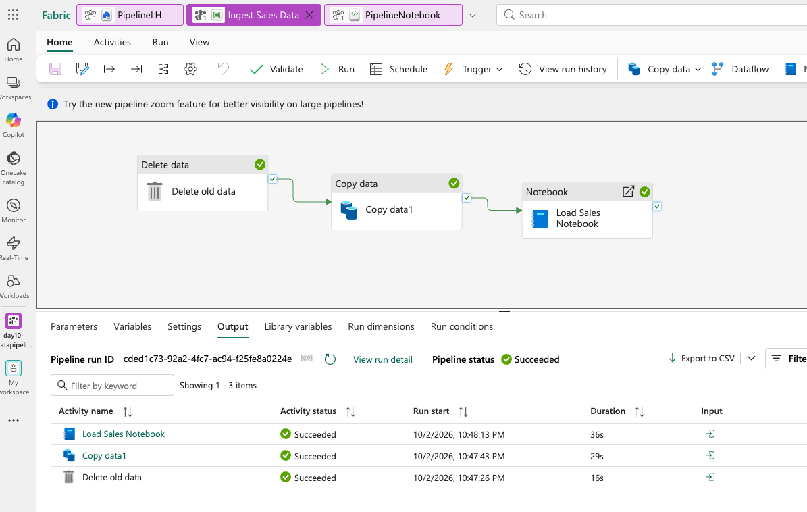

# Microsoft Fabric Boot Camp - Final Day

**Course:** DP-600 – Implement Analytics Solutions Using Microsoft Fabric
**Topics:** Finishing Governance (Day 9 Exercise) · Pipelines & Orchestration (bonus) · Medallion Architecture (bonus)

---

## Completing Day 9: the Governance exercise

- **Promoted a lakehouse and a semantic model** via each item's **Settings → Endorsement**, and added descriptions to both. Reinforced live: **descriptions aren't just for humans** - every time Copilot or a data agent searches across a workspace, it reads these descriptions as grounding context.
- **Tags and domains** (admin portal) applied at the workspace level, confirmed to be **admin-delegatable** - a Fabric admin can grant specific people the ability to create tags, though once granted, that person can edit tags **tenant-wide**, not scoped to just their team (no finer-grained delegation currently exists).
- **OneLake catalog walkthrough**: **Explore** (filtered by endorsement and tags, showed owner/location/lineage per item), **Govern** (a dashboard of governance gaps - e.g., "X% of items have no endorsement" - with a **recommended actions** / policies section), and **Secure** (a cross-workspace view of who has access to what, with the ability to modify access directly from this screen).
- **Lineage view**: switching a workspace from List view to **Lineage view** shows items as connected cards with arrows tracing data flow (lakehouse → SQL analytics endpoint → semantic model).
- **Copilot-generated descriptions**: exists for **semantic models only** (an icon to auto-generate a description) - not available on a warehouse or lakehouse directly.
- **Workspace identity** (a separate workspace setting): gives the workspace its own Entra ID identity so it can authenticate to other Azure resources (relevant when a pipeline needs to connect to external Azure services).

---

## Pipelines & Orchestration

### Dataflow Gen2 vs. Pipelines - the actual distinction
- **Dataflow Gen2** = **transformation** - a low-code, Power-Query-style tool (300+ built-in transforms) for cleaning/shaping data, best suited to **small-to-moderate data with simple logic**.
- **Pipelines** = **orchestration** - chaining multiple steps (copy data, run a notebook, run a Dataflow, control logic) into one automated, sequenced, schedulable workflow. Pipelines are Fabric's built-in equivalent of **Azure Data Factory** (which, confirmed live, **will never be retired** - some organizations will keep using it directly alongside Fabric).
- **Decision rule, stated as likely exam-relevant:** small data + simple transformation → Dataflow Gen2. Large data, loops, ML code, custom Python libraries → a **notebook**, orchestrated and automated by a **pipeline**.

### Pipeline building blocks
- **Activities** = individual steps, in three categories:
  - **Data movement** - e.g., **Copy Data** (move data from a source to a destination).
  - **Data transformation** - calling a **Dataflow Gen2** or a **notebook** from within the pipeline.
  - **Control flow** - conditions, loops, error handling (e.g., a **Fail** activity that deliberately errors the pipeline with a custom message - useful for testing failure handling or stopping on a violated business rule).
- **Parameters** make a pipeline reusable instead of hardcoded - e.g., a Copy Data activity's file name can be a parameter populated dynamically at runtime (from a trigger), rather than a fixed value.
- **Notebook parameter cells**: toggling a notebook cell to **"parameter cell"** lets a pipeline pass in a value (like a file name) when it calls that notebook - flagged as **likely exam-relevant**.
- **Pipeline runs**: each execution gets a unique run ID for auditing. Three ways to trigger a run: **on-demand** (manual), **scheduled**, or **event-based** (e.g., automatically when a new file lands in a storage account).
- **4-step lifecycle**: **Validate** (checks configuration for errors before running) → **Run** (manual, for testing) → **Schedule** (not on by default - must be explicitly turned on) → **Run history** (drill into any past execution's status, duration, and per-step detail - the primary troubleshooting tool).
- **Predefined templates** exist for common scenarios (bulk copy from a database using a control table, copy from ADLS Gen2 to a lakehouse, etc.) - use these instead of building from a blank canvas when your scenario matches one.

### Live demo: an event-triggered ingestion pipeline
Built a full pattern end-to-end: a **Blob Storage event trigger** (fires when a new file lands in a container) → an **Event Stream** capturing that "data in motion" → a **Copy Data** activity (source: the storage account; destination: a lakehouse folder, using the triggered file name as a dynamic parameter rather than hardcoding it) → on success, a **notebook** (with a parameter cell for the file name) that reads the copied file into a DataFrame and appends it to a table. 

---

## Exercise - Build an Ingestion Pipeline
[Ingest data with a pipeline in Microsoft Fabric](https://microsoftlearning.github.io/mslearn-fabric/Instructions/Labs/04-ingest-pipeline.html
)

  

 

Built a two-step pipeline: a **Copy Data** activity pulling a CSV from an HTTP source into a lakehouse (hardcoded paths this time, deliberately simpler than the dynamic demo), followed by a **notebook** (connected to the lakehouse, with a **parameter cell** for the table name) that reads the raw table, adds a derived `CustomerName` column (concatenating first + last name), reorders columns, and writes the result to a new table. The pipeline was then extended with a **delete-existing-files** step (wildcard-matched CSV cleanup before the copy, to avoid duplicate accumulation on reruns) and the notebook's parameter was overridden at the pipeline level to write to a differently-named table than what was hardcoded in the notebook for manual testing.

---

## Medallion Architecture 

### The three layers
| Layer | Purpose | Key properties |
|---|---|---|
| **Bronze** | Raw landing zone for structured, semi-structured, and unstructured source data | **Kept untouched** - if a downstream transformation mistake happens, you can always rebuild from bronze rather than re-ingesting from the original source (which may be slow/expensive for large volumes) |
| **Silver** | Validated, cleaned data - nulls removed, duplicates handled, validation rules enforced, computed columns added | The **trusted, consistent, cross-team reference point** - by the time data lands here, multiple teams can rely on and query it confidently |
| **Gold** | Business/analytics-ready, enriched data - aggregated to the needed grain (daily/hourly sales, etc.), joined with other context | **Consumption-ready** - this is where semantic models get built, secured, and prepped for AI (tying directly back to Days 6–7's content) |

### Four questions that decide which Fabric tool to use at each layer
1. **How much data?** (megabytes vs. terabytes - affects which tool scales)
2. **How complex are the transformations?** (straight copy vs. multi-source joins/business rules)
3. **How often does data need to move?** (one-time historical load vs. continuous/frequent refresh)
4. **What is the team comfortable with?** (low-code visual tool vs. writing code)

**Typical mapping that falls out of these questions:**
- **Bronze ingestion** → a **pipeline** (simple copy), a **Dataflow Gen2** (simple transform-on-ingest), or a **notebook** (if the source/logic is more complex) - all three are valid depending on the four questions above.
- **Silver transformation** → **Dataflow Gen2** or **notebook**, again depending on transformation complexity.
- **Gold** → exposed via the **SQL analytics endpoint** or a **semantic model** - this is the layer meant for direct business consumption.

### Security pattern across the layers
- **Bronze**: typically **read-only**, often in its **own separate workspace** reserved for the data engineering team only.
- **Silver**: shared more selectively - different builder teams get access to the **specific items** they need (item-level permissions), often in their own workspace where they build their own notebooks/reports via shortcuts back to the shared data.
- **Gold**: also **read-only** for consumers, typically in **yet another separate workspace** owned by the team responsible for certifying and AI-prepping the semantic models that live there.

---

## Key Takeaways
- **Descriptions and endorsement aren't just discoverability niceties for humans** - Copilot and data agents read them directly as grounding/trust signals every time they search across a workspace.
- **Deletion-blocking behavior for items with downstream dependencies is inconsistent in practice** - don't assume Fabric will always (or never) stop you; test your specific scenario.
- **Dataflow Gen2 = transformation, Pipelines = orchestration** - the core distinction the exam is likely to test, and the deciding factors are data volume, transformation complexity, and team skill set.
- **Pipeline parameters + notebook parameter cells are how a single pipeline/notebook pair stays reusable** instead of being hardcoded to one file or table name - flagged as likely exam-relevant.
- **Always test pipeline activities individually before chaining them** - build Copy Data, confirm it works, then add the next step.
- **Medallion architecture's layer boundaries map directly onto workspace and security boundaries in practice**: separate workspaces per layer is a common pattern because each layer has a genuinely different audience and permission need, not an arbitrary convention.

## Follow-up
- **Medallion architecture and Pipelines were both explicitly called out as non-DP-600-exam content**, added specifically because of recurring student questions across the course - don't over-invest exam-prep time here relative to the core modules from Days 1–9.
- A **separate hands-on exercise for medallion architecture** (a set of T-SQL/notebook-based labs) exists but wasn't completed live due to time - the instructor offered to share it for self-paced practice.
